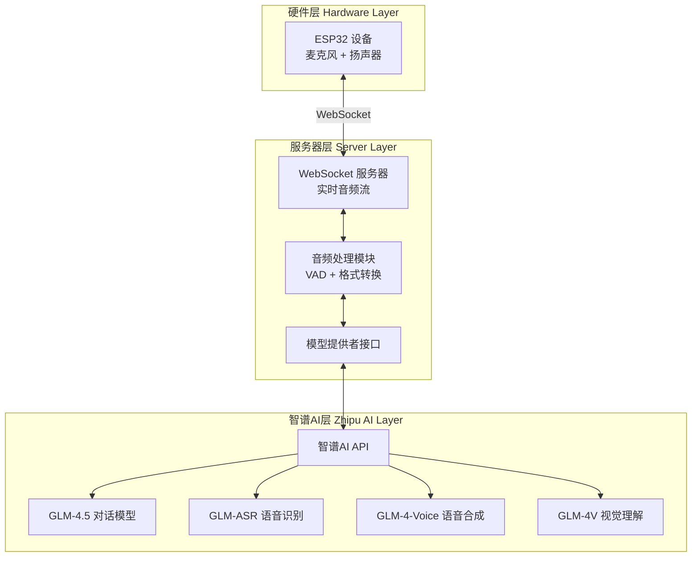
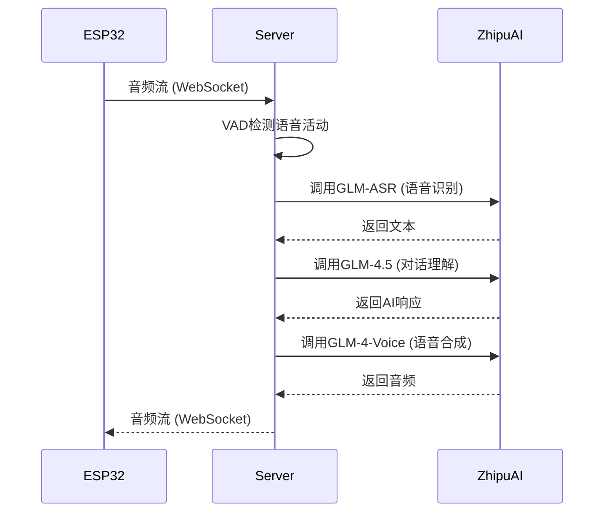

# 小智AI语音助手 - 智谱AI集成版
# Xiaozhi ESP32 AI Voice Assistant - Zhipu AI Integration

<div align="center">


[](https://opensource.org/licenses/MIT)
[](https://www.python.org/)
[](https://open.bigmodel.cn/)
[](https://github.com/YOUR_USERNAME/xiaozhi-esp32-server-glm)

> 🎙️ 开源智能语音助手，基于ESP32硬件与智谱AI大模型
> 
> 原项目来自虾哥 [@78](https://github.com/78) 的开源贡献 
> 
</div>


## 项目概述

本项目是对[小智AI语音助手](https://github.com/78/xiaozhi-esp32)的服务器端进行改造，将原有的认证机制和模型调用替换为智谱AI (Zhipu AI)的API服务，实现与智谱AI全系列模型的无缝对接。


🌐 API 端点与服务地址
以下是项目部署后可用的服务接口地址。
Websocket 接口地址: ws://101.37.205.115:8000/xiaozhi/v1/
视觉模型接口地址: http://101.37.205.115:8003/mcp/vision/explain
服务测试工具: http://101.37.205.115:8003/xiaozhi/ota/
OTA 接口地址: https://2662r3426b.vicp.fun/xiaozhi/ota/


### 系统架构



### 核心特性

- **完整的语音交互**：语音输入 → AI理解 → 语音输出的完整闭环
- **多模型支持**：支持智谱AI全系列模型（GLM-4.5、GLM-4-Voice、GLM-ASR等）
- **实时流式响应**：支持流式输出，降低响应延迟
- **模块化设计**：易于扩展和维护的Provider架构
- **无需Docker**：直接源码部署，便于调试和定制

## 快速开始
### 1. 环境要求

- **服务器**: 阿里云ECS或其他Linux服务器
- **Python**: 3.8+
- **系统**: Linux (推荐 Alibaba Cloud Linux 3.x)
- **内存**: 8GB+
- **网络**: 公网IP，开放必要端口

### 2. 获取智谱AI API Key

1. 访问 [智谱开放平台](https://open.bigmodel.cn)
2. 注册并登录账户
3. 在 API Keys 管理页面创建 API Key
4. 保存您的 API Key

### 3. 克隆项目

```bash
# Fork 原项目到您的GitHub账户
# 克隆您的Fork版本
git clone https://github.com/YOUR_USERNAME/xiaozhi-esp32-server.git
cd xiaozhi-esp32-server

# 添加原项目为上游仓库（保持同步）
git remote add upstream https://github.com/78/xiaozhi-esp32-server.git
```

### 4. 安装依赖

```bash
# 安装Python依赖
pip install -r requirements.txt

```

## 快速开始

### 1. 克隆项目

```bash
git clone https://github.com/YOUR_USERNAME/GLM-Xiaozhi.git
cd GLM-Xiaozhi.git
```

### 2. 安装依赖

```bash
python3 -m venv venv

source venv/bin/activate
which python

pip install -r requirements.txt
```

### 3. 配置API密钥
项目通过 config.yaml 文件进行管理。为了保护您的密钥安全，推荐使用覆盖配置的方式：
在项目根目录创建 data 文件夹。
在 data 文件夹内创建一个空的 .config.yaml 文件。
将您需要修改的配置项（例如API密钥）从主 config.yaml 复制到 data/.config.yaml 中并修改。
系统会优先加载 data/.config.yaml 中的配置。


编辑 `config/config.yaml`（或相应的配置文件）：


```yaml
# 智谱API配置
LLM:
  GLM-45:
    api_key: YOUR_GLM_API_KEY  # 替换为您的API密钥
    temperature: TEMPERATURE
    max_tokens: MAX
```


### 4. 启动服务器

```bash
# 直接运行
python main.py

# 或使用后台运行
nohup python main.py > xiaozhi.log 2>&1 &

# 使用systemd服务（推荐）
sudo systemctl start xiaozhi-server
```


服务启动后：
- WebSocket地址: `ws://YOUR_IP:8000/xiaozhi/v1/`
- OTA配置地址: `http://YOUR_IP:8003/xiaozhi/ota/`


## ESP32设备连接

### 方式一：OTA配置（推荐）
1. 访问 `http://YOUR_IP:8003/xiaozhi/ota/`
2. ESP32进入配网模式
3. 输入WebSocket地址并保存

### 方式二：ESP-IDF配置
```bash
idf.py menuconfig
# 设置WebSocket服务器地址
idf.py build && idf.py flash
```


## Provider实现细节

### LLM Provider (对话模型)

```python
# 核心功能
- response(): 流式生成对话响应
- response_with_functions(): 支持函数调用的响应
```

### TTS Provider (语音合成)

```python
# 核心功能
- text_to_speak(): 文本转语音
- speech_to_text(): 语音转文本（ASR）
```

### VLLM Provider (视觉模型)

```python
# 核心功能
- response(): 图像理解和分析
- analyze_image(): 预定义的图像分析
- compare_images(): 图像对比
```

## 🔄 工作流程



## 配置ESP32硬件

### OTA配置

通过ESP-IDF menuconfig配置OTA更新：

```bash
idf.py menuconfig
# 配置服务器地址: 101.37.205.115
# 配置WebSocket端口
```

### 固件烧录

```bash
# 编译固件
idf.py build

# 烧录到ESP32
idf.py flash

# 监控输出
idf.py monitor
```

## 📊 性能优化

### 1. 流式响应优化
- 使用流式API减少首字节延迟
- 实现增量式TTS合成

### 2. 并发处理
- 支持多设备同时连接
- 使用异步处理提高吞吐量

### 3. 缓存策略
- 缓存常用语音片段
- 实现智能预加载

## 🔍 调试与监控

### 日志查看

```bash
# 查看实时日志
tail -f logs/xiaozhi.log

# 查看错误日志
grep ERROR logs/xiaozhi.log
```

### 性能监控

```bash
# 查看系统资源
htop

# 查看网络连接
netstat -antp | grep python
```

## 📝 API费用说明

| 模型        | 价格            | 用途     |
| ----------- | --------------- | -------- |
| GLM-4.5     | 96K上下文       | 对话理解 |
| GLM-4-Voice | 80元/百万Tokens | 语音合成 |
| GLM-ASR     | 0.06元/分钟     | 语音识别 |
| GLM-4V      | 视觉理解        | 图像分析 |


## 📄 开源协议

本项目基于原项目的开源协议，感谢虾哥的开源贡献。

## 🙏 致谢

- [虾哥 @78](https://github.com/78) - 小智AI语音助手原作者
- [智谱AI](https://www.zhipuai.cn/) - 提供强大的AI模型支持
- 所有贡献者和使用者

## 📞 联系方式

- 原项目: https://github.com/78/xiaozhi-esp32
- 服务器端: https://github.com/78/xiaozhi-esp32-server
- 问题反馈: 请在GitHub Issues中提交

## 🔗 相关资源

- [智谱AI官方文档](https://open.bigmodel.cn/dev/api)
- [ESP32开发文档](https://docs.espressif.com/projects/esp-idf/zh_CN/latest/esp32/)
- [小智硬件制作教程](https://github.com/78/xiaozhi-esp32)

---

**注意**: 本项目仅供学习和研究使用。

 


### 核心功能
- GLM-4.5系列大语言模型、GLM-4-Voice语音对话、GLM-ASR语音识别
- AutoGLM MCP协议 - 智能手机控制、任务自动化、跨设备协同
-  纯Python实现，移除冗余组件，专注核心功能
- 保持原项目结构，最小化改动，便于维护升级
- 支持阿里云ECS一键部署，无需Docker


## 系统要求

### 硬件配置
- **最低配置**: 2核4GB内存（纯API调用）
- **推荐配置**: 4核8GB内存（包含本地模型）
- **存储空间**: 至少10GB可用空间

### 软件环境
- **操作系统**: Linux (推荐Alibaba Cloud Linux 3.2104)
- **Python版本**: 3.8+
- **网络要求**: 能访问 https://open.bigmodel.cn


## 性能比较 

|     模块名称     |            免费设置            |              paid               |
| :--------------: | :----------------------------: | :-----------------------------: |
|  ASR(语音识别)   |          FunASR(本地)          |
|   LLM(大模型)    | 智谱glm-4-flash，glm-4.5-flash |           glm-4-flash           |
| VLLM(视觉大模型) |       智谱glm-4v-flash,        |        flash，glm-4.5-v         |
|  TTS(语音合成)   |            EdgeTTS             |      CogTTS (need tolken)       |
| Intent(意图识别) |    function_call(函数调用)     |     function_call(函数调用)     |
| Memory(记忆功能) | mem_local_short(本地短期记忆） | mem_local_short（本地短期记忆） |


+--------------+-------------+---------------+-------+------+
| 模型名称         |   平均响应时间(s) |   首Token时间(s) | 成功率   | 状态   |
+==============+=============+===============+=======+======+
| GLM-4-Plus   |       2.134 |         0.585 | 3/3   | ✅ 正常 |
+--------------+-------------+---------------+-------+------+
| ChatGLMLLM   |       2.035 |         0.739 | 3/3   | ✅ 正常 |
+--------------+-------------+---------------+-------+------+
| GLM-45-AirX  |       1.682 |         1.297 | 3/3   | ✅ 正常 |
+--------------+-------------+---------------+-------+------+
| GLM-45-Air   |       1.856 |         1.394 | 3/3   | ✅ 正常 |
+--------------+-------------+---------------+-------+------+
| GLM-4        |       2.679 |         1.566 | 3/3   | ✅ 正常 |
+--------------+-------------+---------------+-------+------+
| GLM45        |       2.917 |         2.374 | 3/3   | ✅ 正常 |
+--------------+-------------+---------------+-------+------+
| GLM-45-X     |       2.544 |         2.636 | 3/3   | ✅ 正常 |
+--------------+-------------+---------------+-------+------+
| GLM-45-Flash |       5.418 |         4.404 | 2/3   | ✅ 正常 |
+--------------+-------------+---------------+-------+------+


视觉大模型性能排行:

| 模型名称               | 响应耗时 | 稳定性 |
| ---------------------- | -------- | ------ |
| ChatGLMVLLM            | 3.221秒  | 0.483  |
| GLM-45V                | 6.923秒  | 0.343  |
| GLM-41V-Thinking-Flash | 6.820秒  | 0.523  |


| 模型名称  | 平均耗时 |
| --------- | -------- |
| FunASR    | 3.058秒  |
| SherpaASR | 2.867秒  |
| GLMASR    | 4.374秒  |


## 存在的问题


## 特色功能

音乐播放
本地音乐：播放存储的音乐文件，也可以用酷我音乐， 推荐音乐 （结合心境） 有视频
在线音乐：通过AutoGLM控制音乐APP,
语音点歌："播放周杰伦的歌"


记忆功能
短期记忆：记住当前对话内容： GLM 4.5 Airt

偏好记忆：记住用户习惯和喜好
任务跟踪：跟进待办事项完成情况

1. 特色功能 ⭐
小平老师模式
技术讲解：深入浅出讲解AI技术
编程辅导：Python、JavaScript代码指导
项目咨询：智能硬件开发建议
记忆功能
短期记忆：记住当前对话内容
偏好记忆：记住用户习惯和喜好
任务跟踪：跟进待办事项完成情况

