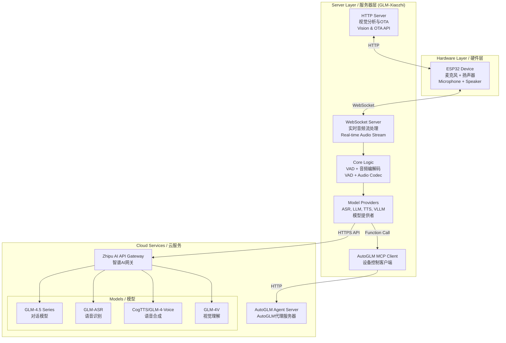

# GLM-Xiaozhi 小智AI语音助手 - 智谱AI集成版

<div align="center">


[](https://opensource.org/licenses/MIT)
[](https://www.python.org/)
[](https://open.bigmodel.cn/)
[](https://github.com/YOUR_USERNAME/xiaozhi-esp32-server-glm)

> 🎙️ **构建你自己的AI语音助手！基于ESP32硬件与智谱AI大模型的开源智能语音助手**
> 
> **Build your own AI voice assistant! Open-source intelligent voice assistant powered by ESP32 hardware and Zhipu AI models**
> 
> *本项目是对[@78](https://github.com/78)的开源项目[xiaozhi-esp32-server](https://github.com/xinnan-tech/xiaozhi-esp32-server)的重大功能增强*
>
> *This project is a major enhancement of [@78](https://github.com/78)'s open-source [xiaozhi-esp32-server](https://github.com/xinnan-tech/xiaozhi-esp32-server)*

</div>


## Project Overview / 概述

`GLM-Xiaozhi` 是一个开源、可自托管的后端服务，旨在让开发者和技术爱好者能够完全掌控自己的AI语音助手。通过替换广受欢迎的[小智AI语音助手](https://github.com/xinnan-tech/xiaozhi-esp32)的原版后端，本项目集成了**智谱AI（GLM）** 的全套模型服务，为强大的对话式AI、实时语音交互以及创新的**AutoGLM**设备自动化代理功能提供了坚实的基础。

`GLM-Xiaozhi` is an open-source, self-hostable backend service that allows developers and tech enthusiasts to take full control of their AI voice assistant. By reconstructing the original backend of the popular [Xiaozhi AI Voice Assistant](https://github.com/xinnan-tech/xiaozhi-esp32), this project integrates [**Zhipu AI (GLM)**'s](https://bigmodel.cn/) large-language models that provide a solid foundation for powerful conversational AI, real-time voice interaction, and innovative **AutoGLM** device automation capabilities.


## 核心特性
- 完全私有化: 所有服务均部署在您自己的服务器上，彻底摆脱对外部服务的依赖，确保数据隐私和安全。
- 智谱AI全家桶: 无缝集成智谱AI的旗舰模型，包括：
    - 语言模型: GLM-4.5系列，提供强大的对话理解和逻辑推理能力。
    - 语音识别 (ASR): glm-asr，专为语音识别优化，准确高效。
    - 语音合成 (TTS): cogtts 或 glm-4-voice，提供自然流畅的语音输出。
    - 视觉模型 (VLLM): glm-4v-flash 或 glm-4.5v，赋予小智看懂世界的能力。
    - AutoGLM 智能控制: 通过MCP协议与AutoGLM代理通信，实现对手机、电脑等设备的自动化控制，例如“帮我打开音乐App并播放周杰伦的歌”。
- 模块化与高扩展性: 项目采用Provider模式设计，无论是更换模型还是增加新功能，都变得异常简单。
- 轻量化部署: 无需复杂的Docker容器，直接通过源码运行，方便开发者进行调试和个性化定制。


| Feature / 特性 | Description / 描述 |
|---------------|-------------------|
| **🔒 Self-hosted & Controllable / 自托管与可控** | Run the entire backend on your own server with complete data control / 在您自己的服务器上运行，完全掌控数据 |
| **🤖 Zhipu AI Powered / 智谱AI强力驱动** | Full integration with GLM-4.5 series, ASR, TTS, and Vision models / 全面集成GLM-4.5系列、语音识别、语音合成和视觉模型 |
| **🎯 AutoGLM Agent Control / AutoGLM智能代理控制** | Transform your assistant into a powerful automation agent via MCP protocol / 通过MCP协议将助手转变为强大的自动化代理 |
| **📦 Modular Architecture / 模块化架构** | Clean Provider pattern for easy model switching and feature extension / 简洁的Provider架构，便于模型切换和功能扩展 |
| **🚀 Lightweight Deployment / 轻量化部署** | Direct source deployment without Docker complexity / 无需Docker，直接源码部署 |


## System Architecture / 系统架构

### Overall Architecture / 整体架构



### Core Workflow / 核心工作流程

```mermaid
graph TB
    participant User as User/用户
    participant ESP32 as ESP32 Device
    participant Server as GLM-Xiaozhi Server
    participant AI as Zhipu AI API

    User->>ESP32: Voice Input / 语音输入
    ESP32->>Server: Audio Stream (WebSocket)
    Server->>Server: 1. VAD Detection / 静音检测
    Server->>AI: 2. ASR (Speech→Text) / 语音识别
    AI-->>Server: Text Result / 文本结果
    Server->>AI: 3. LLM Processing / 大模型处理
    AI-->>Server: AI Response / AI响应
    Server->>AI: 4. TTS (Text→Speech) / 语音合成
    AI-->>Server: Audio Data / 音频数据
    Server-->>ESP32: Audio Stream
    ESP32-->>User: Voice Output / 语音输出
```


## AutoGLM Integration / AutoGLM集成

**AutoGLM** transforms Xiaozhi from a conversationalist to an **actor**, leveraging Zhipu GLM's powerful **Function Calling** capabilities to execute tasks on connected devices.

**AutoGLM** 将小智从一个对话者提升为一个**行动者**，利用智谱GLM强大的**函数调用**能力在关联设备上执行任务。

### Working Principle / 工作原理

```mermaid
graph TD
    A[Voice Command<br/>语音指令<br/>"打开音乐App播放爵士乐"] --> B{Intent Recognition<br/>意图识别<br/>Function Calling}
    B -->|Detected Control Intent<br/>识别控制意图| C[Call autoglm_control<br/>调用控制函数]
    C -->|Task Description<br/>任务描述| D[MCP Client<br/>MCP客户端]
    D -->|HTTP POST| E[AutoGLM Server<br/>AutoGLM服务器]
    E --> F[Execute Automation<br/>执行自动化<br/>(adb/appium)]
    F --> G[Return Status<br/>返回状态]
    G --> H[Generate Response<br/>生成响应]
    H --> I[TTS & Playback<br/>语音合成播放]
```


### Core Control File / 核心控制文件

**Path / 路径**: `plugins_func/functions/autoglm_control.py`

```python
@register_function
async def autoglm_control(task_description: str, action: str = "start_task"):
    """
    Control devices through AutoGLM
    通过AutoGLM控制设备
    
    Args:
        task_description: Natural language task description
        action: Control action (start_task/get_status/stop_task)
    """
    # Function registration exposes this tool to LLM
    # API communication via aiohttp to AutoGLM server
    # Response generation based on task results
```

### Example Commands / 示例命令

| Command Type / 命令类型 | Examples / 示例 |
|------------------------|----------------|
| **Music Control / 音乐控制** | "打开网易云音乐播放周杰伦" / "Open Spotify and play jazz" |
| **Messaging / 消息** | "打开微信发送消息" / "Open WeChat and send a message" |
| **Calendar / 日程** | "查看今天的日程安排" / "Check today's schedule" |
| **System / 系统** | "设置明天8点的闹钟" / "Set an alarm for 8 AM tomorrow" |


## Model Selection Guide / 模型选择

Choose the optimal model configuration based on your requirements:

### Language Models (LLM) / 语言模型

| Model / 模型  | Best For / 适用场景 |
|-------------|-------------|-------------------|------------|-------------------|
| **glm-4-flash** |  Quick responses, daily Q&A / 快速响应，日常问答 |
| **glm-4.5-flash** | | Fast interactions / 快速交互 |
| **glm-4.5-air**  | **Balanced choice / 平衡之选** ✅ |
| **glm-4.5-airx**  | Complex tasks / 复杂任务 |
| **glm-4.5-x** | ⚡⚡ | ⭐⭐⭐⭐⭐ | 💰💰💰💰 | Maximum capability / 最强能力 |

### Vision Models (VLLM) / 视觉模型

| Model / 模型 | Response Time / 响应时间 | Capability / 能力 | Recommendation / 推荐度 |
|-------------|------------------------|------------------|----------------------|
| **glm-4v-flash** | ~3.2s | Basic vision / 基础视觉 | ★★★★★ |
| **glm-4.1v-thinking-flash** | ~6.8s | Reasoning / 推理分析 | ★★★★☆ |
| **glm-4.5v** | ~6.9s | Advanced analysis / 高级分析 | ★★★★☆ |

### Audio Models / 音频模型

| Type / 类型 | Model / 模型 | Cost / 成本 | Quality / 质量 | Privacy / 隐私 | Recommendation / 推荐 |
|------------|-------------|------------|---------------|---------------|-------------------|
| **ASR** | GLMASR (API) | Pay-per-use / 按量 | ★★★★★ | Cloud / 云端 | ★★★★★ |
| **ASR** | FunASR (Local) | Free / 免费 | ★★★★☆ | Local / 本地 | ★★★★☆ |
| **TTS** | CogTTS | Pay-per-use / 按量 | ★★★★★ | Cloud / 云端 | ★★★★★ |
| **TTS** | EdgeTTS | Free / 免费 | ★★★☆☆ | Microsoft | ★★★☆☆ |


## Performance Benchmarks / 性能测试

*All tests conducted on 2-core 8GB cloud server / 所有测试在2核8GB云服务器上进行*

### LLM Performance / 语言模型性能

**Test Query / 测试语句**: "你好，请介绍一下你自己"

| Model / 模型 | Total Time / 总耗时 | First Token / 首Token | Success Rate / 成功率 | Status / 状态 |
|-------------|-------------------|---------------------|---------------------|--------------|
| **GLM-45-AirX** | **1.682s** | 1.297s | 100% (3/3) | ✅ Optimal |
| **GLM-45-Air** | 1.856s | 1.394s | 100% (3/3) | ✅ Excellent |
| **ChatGLMLLM** | 2.035s | **0.739s** | 100% (3/3) | ✅ Fast First |
| **GLM-4-Plus** | 2.134s | **0.585s** | 100% (3/3) | ✅ Premium |
| **GLM-45-X** | 2.544s | 2.636s | 100% (3/3) | ✅ Normal |
| **GLM-4** | 2.679s | 1.566s | 100% (3/3) | ✅ Normal |
| **GLM-45** | 2.917s | 2.374s | 100% (3/3) | ✅ Normal |
| **GLM-45-Flash** | 5.418s | 4.404s | 67% (2/3) | ⚠️ Unstable |

### Vision Model Performance / 视觉模型性能

| Model / 模型 | Response Time / 响应时间 | Stability / 稳定性 | Recommendation / 推荐 |
|-------------|------------------------|-------------------|-------------------|
| **ChatGLMVLLM (glm-4v-flash)** | **3.221s** | 0.483 | ⭐⭐⭐⭐⭐ |
| **GLM-41V-Thinking-Flash** | 6.820s | 0.523 | ⭐⭐⭐⭐ |
| **GLM-45V** | 6.923s | 0.343 | ⭐⭐⭐ |

### ASR Performance / 语音识别性能

| Model / 模型 | Average Time / 平均耗时 | Type / 类型 | Recommendation / 推荐 |
|-------------|----------------------|------------|-------------------|
| **SherpaASR** | **2.867s** | Local / 本地 | ⭐⭐⭐⭐⭐ |
| **FunASR** | 3.058s | Local / 本地 | ⭐⭐⭐⭐ |
| **GLMASR** | 4.374s | API / 云端 | ⭐⭐⭐ |


## Quick Start / 快速入门

### System Requirements / 系统要求

| Component / 组件 | Minimum / 最低配置 | Recommended / 推荐配置 |
|-----------------|-------------------|----------------------|
| **CPU** | 2 cores | 4+ cores |
| **RAM** | 4GB (API only) | 8GB+ (with local models) |
| **Storage** | 10GB | 20GB+ |
| **OS** | Linux (Ubuntu 20.04+, CentOS 7+) | Ubuntu 22.04 LTS |
| **Python** | 3.8+ | 3.10+ |
| **Network** | Public IP, ports 8000, 8003 | Dedicated server |

### Installation Steps / 安装步骤

#### 1️⃣ Get Zhipu AI API Key / 获取智谱AI密钥

Visit [Zhipu AI Platform](https://open.bigmodel.cn) to register and create your API key.

访问[智谱开放平台](https://open.bigmodel.cn)注册并创建API密钥。

#### 2️⃣ Clone Repository / 克隆仓库

```bash
# Clone the repository / 克隆项目
git clone https://github.com/YOUR_USERNAME/GLM-Xiaozhi.git
cd GLM-Xiaozhi

# Add upstream for updates / 添加上游仓库以获取更新
git remote add upstream https://github.com/78/xiaozhi-esp32-server.git
```

#### 3️⃣ Setup Python Environment / 设置Python环境

```bash
# Create virtual environment / 创建虚拟环境
python3 -m venv venv
source venv/bin/activate  # On Windows: venv\Scripts\activate

# Verify Python version / 验证Python版本
python --version

# Install dependencies / 安装依赖
pip install -r requirements.txt
```

#### 4️⃣ Configure API Keys / 配置API密钥

Create secure configuration override / 创建安全配置覆盖:

```bash
# Create data directory / 创建数据目录
mkdir data

# Create override config / 创建覆盖配置
touch data/.config.yaml
```

Edit `data/.config.yaml`:

```yaml
# Zhipu AI Configuration / 智谱AI配置
LLM:
  GLM-45:
    api_key: "YOUR_ZHIPU_API_KEY"
    temperature: 0.7  # Optional / 可选
    max_tokens: 2048  # Optional / 可选
  ChatGLMLLM:
    api_key: "YOUR_ZHIPU_API_KEY"

VLLM:
  ChatGLMVLLM:
    api_key: "YOUR_ZHIPU_API_KEY"

ASR:
  GLMASR:
    api_key: "YOUR_ZHIPU_API_KEY"

TTS:
  CogTTS:
    api_key: "YOUR_ZHIPU_API_KEY"

# AutoGLM Configuration (Optional) / AutoGLM配置（可选）
autoglm:
  api_key: "YOUR_AUTOGLM_TOKEN"
  base_url: "http://your-autoglm-server:port"
```

模块选择  selected_module

```yaml
# config.yaml
selected_module:
  llm: "ChatGLMLLM"   # LLM provider / 语言模型
  asr: "GLMASR"       # ASR provider / 语音识别
  tts: "CogTTS"       # TTS provider / 语音合成
  vllm: "ChatGLMVLLM" # Vision provider / 视觉模型

```


### Example Service Endpoints / 服务接口地址*

| Service / 服务 | URL | Description / 描述 |
|---------------|-----|-------------------|
| **WebSocket** | `ws://101.37.205.115:8000/xiaozhi/v1/` | Real-time audio streaming / 实时音频流 |
| **Vision API** | `http://101.37.205.115:8003/mcp/vision/explain` | Image analysis / 图像分析接口 |
| **Test Tool** | `http://101.37.205.115:8003/xiaozhi/ota/` | Service testing / 服务测试工具 |
| **OTA Config** | `https://2662r3426b.vicp.fun/xiaozhi/ota/` | OTA configuration / OTA配置接口 |


#### 5️⃣ Start the app

直接运行

```bash
# Direct run / 直接运行
python app.py

# Background run / 后台运行
nohup python app.py > xiaozhi.log 2>&1 &

```

服务器

```
# Using systemd (Recommended for production / 生产环境推荐)
sudo systemctl start glm-xiaozhi.service

sudo systemctl enable glm-xiaozhi  # Auto-start on boot / 开机自启

# Check logs / 查看日志
sudo journalctl -u glm-xiaozhi -f
```

### Logging & Debugging / 日志与调试

```bash
# Real-time logs / 实时日志
tail -f xiaozhi.log

# Error filtering / 错误过滤
grep ERROR xiaozhi.log

# System monitoring / 系统监控
htop
iotop
nethogs

# Service status / 服务状态
systemctl status glm-xiaozhi
```

## ESP32 Device Configuration / ESP32设备配置

#### Method 1: Web OTA / 网页OTA配置

1. Access / 访问: `http://YOUR_SERVER_IP:8003/xiaozhi/ota/`
2. Enter configuration / 输入配置:
   - WebSocket URL: `ws://YOUR_SERVER_IP:8000/xiaozhi/v1/`
   - Vision API: `http://YOUR_SERVER_IP:8003/mcp/vision/explain`
3. Save and restart device / 保存并重启设备

#### Method 2: ESP-IDF / ESP-IDF配置

```bash
# Configure / 配置
idf.py menuconfig
# Navigate to Xiaozhi Configuration
# Set server addresses

# Build and flash / 编译烧录
idf.py build
idf.py flash

# Monitor / 监控
idf.py monitor
```


## 🎯 Special Features / 特色功能

### 👨‍🏫 "Teacher Xiaoping" Persona / "小平老师"角色

A built-in AI assistant persona specialized in technology and education:

内置的技术教育专家AI角色：

- **Technical Explanations / 技术解读**: "小平老师，解释一下transformer架构"
- **Programming Help / 编程辅助**: "小平老师，帮我写一个快速排序算法"
- **Project Consulting / 项目咨询**: "小平老师，智能家居项目有什么建议？"

Customize personas in `config.yaml`:

```yaml
prompt:
  system_prompt: |
    你是小平老师，一位精通智谱AI全栈技术的专家...
    You are Teacher Xiaoping, an expert in Zhipu AI technologies...
```

### 🎵 Music Control / 音乐控制

| Type / 类型 | Method / 方法 | Example / 示例 |
|------------|--------------|---------------|
| **Local / 本地** | Place `.mp3` in `music/` folder | "播放音乐" |
| **Online / 在线** | Stream via network | "播放网络音乐" |
| **App Control / 应用控制** | Via AutoGLM | "打开Spotify播放爵士乐" |

### 🧠 Memory System / 记忆系统

| Type / 类型 | Status / 状态 | Description / 描述 |
|------------|--------------|-------------------|
| **Short-term / 短期** | ✅ Active | Current conversation context / 当前对话上下文 |
| **Long-term / 长期** | 🚧 Planned | User preferences via mem0ai / 用户偏好存储 |

---

## 🔧 Development / 开发

### Provider Architecture / Provider架构

```python
# Example: Custom LLM Provider / 自定义LLM提供者示例
class CustomLLMProvider(BaseLLMProvider):
    """Custom LLM provider implementation"""
    
    async def response(self, prompt: str) -> str:
        """Generate response for prompt"""
        # Implementation here
        pass
    
    async def response_with_functions(
        self, 
        prompt: str, 
        functions: list
    ) -> dict:
        """Generate response with function calling"""
        # Implementation here
        pass
```

### Adding New Models / 添加新模型

1. **Create Provider / 创建提供者**: Implement provider class in appropriate directory
2. **Register / 注册**: Add to configuration file
3. **Select / 选择**: Update `selected_module` in config
4. **Test / 测试**: Verify functionality


## Troubleshooting / 故障排除

### Common Issues / 常见问题

#### WebSocket Connection Failed / WebSocket连接失败

```bash
# Check firewall / 检查防火墙
sudo firewall-cmd --add-port=8000/tcp --permanent
sudo firewall-cmd --add-port=8003/tcp --permanent
sudo firewall-cmd --reload

# Verify server status / 验证服务器状态
netstat -antp | grep python
ps aux | grep app.py
```

#### GLM-4-Voice Issues / GLM-4-Voice问题

- **Problem / 问题**: API occasionally returns errors / API偶尔返回错误
- **Solution / 解决**: Use CogTTS as primary TTS / 使用CogTTS作为主要TTS

#### High Latency / 高延迟

1. Switch to Flash models / 切换到Flash模型
2. Enable local ASR if possible / 启用本地ASR
3. Check network connectivity / 检查网络连接
4. Monitor server resources / 监控服务器资源


## Acknowledgments / 致谢

This project stands on the shoulders of giants. Special thanks to:

本项目基于开源社区的贡献，特别感谢：

- **[@78 (虾哥)](https://github.com/78)** - Original Xiaozhi creator / 小智原作者
- **[Zhipu AI / 智谱AI](https://www.zhipuai.cn/)** - AI model provider / AI模型提供方
- **Open Source Community / 开源社区** - All contributors / 所有贡献者

### Related Resources / 相关资源

- 📦 [Original Project / 原项目](https://github.com/78/xiaozhi-esp32)
- 🖥️ [Server Repository / 服务器端](https://github.com/78/xiaozhi-esp32-server)
- 📚 [Zhipu AI Docs / 智谱AI文档](https://open.bigmodel.cn/dev/api)
- 🔧 [ESP32 Documentation / ESP32文档](https://docs.espressif.com/projects/esp-idf/zh_CN/latest/esp32/)
- 🛠️ [Hardware Tutorial / 硬件教程](https://github.com/78/xiaozhi-esp32)


<div align="center">

**⚠️ Disclaimer / 免责声明**

This project is for learning and research purposes only.  
本项目仅供学习和研究使用。

**Made with ❤️ by the Xiaozhi Community**

**由小智社区用❤️打造**

</div>
