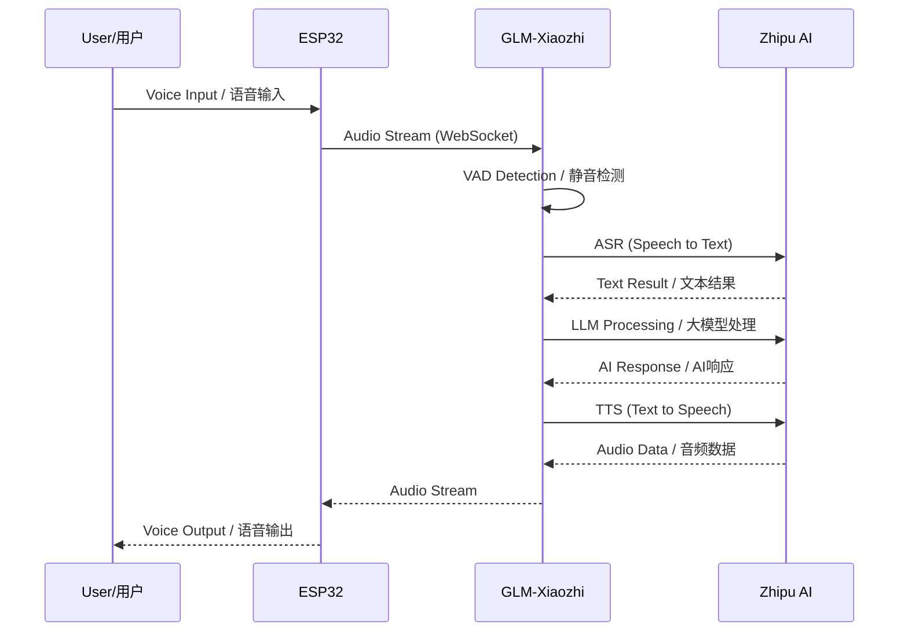
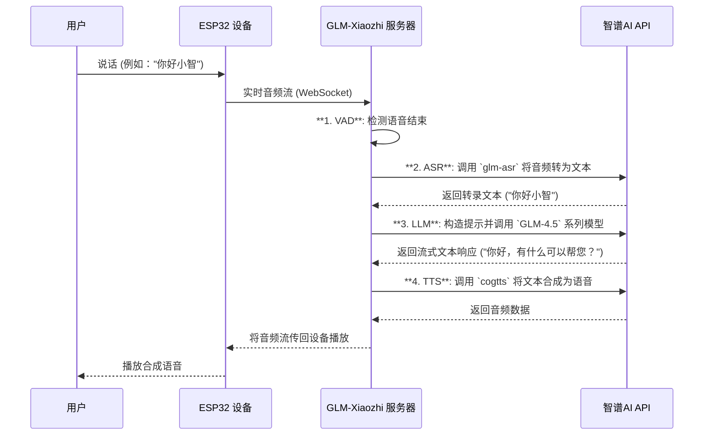
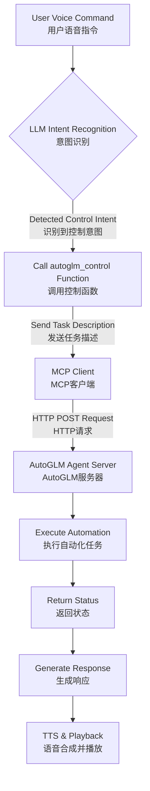

# GLM-Xiaozhi 小智AI语音助手 - 智谱AI集成版

<div align="center">


[](https://opensource.org/licenses/MIT)
[](https://www.python.org/)
[](https://open.bigmodel.cn/)
[](https://github.com/YOUR_USERNAME/xiaozhi-esp32-server-glm)

> 🎙️ **Open-source intelligent voice assistant powered by ESP32 hardware and Zhipu AI models**
> 
> 基于ESP32硬件与智谱AI大模型的开源智能语音助手
> 
> Original project by [@78](https://github.com/78) | 原项目来自虾哥的开源贡献

</div>

<<<<<<< HEAD
---

## 📌 Table of Contents / 目录

- [Project Overview / 项目概述](#project-overview--项目概述)
- [System Architecture / 系统架构](#system-architecture--系统架构)
- [Core Features / 核心特性](#core-features--核心特性)
- [Quick Start / 快速开始](#quick-start--快速开始)
- [Model Selection Guide / 模型选择指南](#model-selection-guide--模型选择指南)
- [Performance Benchmarks / 性能测试](#performance-benchmarks--性能测试)
- [AutoGLM Integration / AutoGLM集成](#autoglm-integration--autoglm集成)
- [Configuration / 配置](#configuration--配置)
- [Troubleshooting / 故障排除](#troubleshooting--故障排除)
- [Contributing / 贡献](#contributing--贡献)

---

## Project Overview / 项目概述

**GLM-Xiaozhi** is a comprehensive transformation of the [Xiaozhi AI Voice Assistant](https://github.com/78/xiaozhi-esp32) server backend, implementing seamless integration with Zhipu AI's full model suite. This project provides a complete private deployment solution that eliminates dependency on official servers while delivering enhanced conversational, voice, and visual capabilities.

本项目是对[小智AI语音助手](https://github.com/78/xiaozhi-esp32)服务器端的全面改造，实现与智谱AI全系列模型的无缝对接，提供完全私有化的部署方案。

### 🌟 Key Highlights / 核心亮点

- **🔒 Complete Privatization / 完全私有化**: Deploy all services on your own server for maximum data privacy
- **🤖 Zhipu AI Full Stack / 智谱AI全家桶**: Integrated support for GLM-4.5 series, voice models, and vision capabilities
- **🎯 AutoGLM Control / 智能控制**: Device automation through MCP protocol integration
- **📦 Modular Architecture / 模块化架构**: Easy-to-extend Provider pattern design
- **🚀 Lightweight Deployment / 轻量化部署**: Direct source code deployment without Docker dependencies

---

## System Architecture / 系统架构

### Overall Architecture Diagram / 整体架构图

```mermaid
graph TB
    subgraph "Hardware Layer / 硬件层"
        ESP32[ESP32 Device<br/>麦克风 + 扬声器<br/>Microphone + Speaker]
    end
    
    subgraph "Server Layer / 服务器层"
        WS[WebSocket Server<br/>实时音频流处理<br/>Real-time Audio Stream]
        HTTP[HTTP Server<br/>视觉分析与OTA<br/>Vision & OTA]
        AUDIO[Audio Processing<br/>VAD + 格式转换<br/>VAD + Format Conversion]
        PROVIDER[Model Providers<br/>模型提供者接口]
        MCP[AutoGLM MCP Client<br/>设备控制客户端]
    end
    
    subgraph "Zhipu AI Cloud / 智谱AI云端"
        ZHIPU[Zhipu AI API Gateway]
        GLM[GLM-4.5 对话模型<br/>Dialogue Model]
        ASR[GLM-ASR 语音识别<br/>Speech Recognition]
        TTS[GLM-4-Voice 语音合成<br/>Voice Synthesis]
        VISION[GLM-4V 视觉理解<br/>Vision Understanding]
    end
    
    ESP32 <-->|WebSocket| WS
    WS <--> AUDIO
    AUDIO <--> PROVIDER
    PROVIDER <--> ZHIPU
    PROVIDER <--> MCP
    ZHIPU --> GLM
    ZHIPU --> ASR
    ZHIPU --> TTS
    ZHIPU --> VISION
=======
# GLM-Xiaozhi: 基于智谱AI的开源语音助手后端

<div align="center">


[](https://opensource.org/licenses/MIT)
[](https://www.python.org/)
[](https://open.bigmodel.cn/)

> 🎙️ **构建你自己的AI语音助手！** 这是一个为ESP32硬件设计的开源后端，由智谱AI（GLM）的先进模型强力驱动。
>
> *本项目是对[@78](https://github.com/78)的开源项目[xiaozhi-esp32-server](https://github.com/xinnan-tech/xiaozhi-esp32-server)的重大功能增强。衷心感谢原作者及开源社区的贡献！*

</div>

---
### **服务接口地址 (示例)**
>>>>>>> ef0082b (docs: note that large model files are excluded and how to add them)
```
视觉分析接口: [http://101.37.205.115:8003/mcp/vision/explain](http://101.37.205.115:8003/mcp/vision/explain)
服务测试工具: [http://101.37.205.115:8003/xiaozhi/ota/](http://101.37.205.115:8003/xiaozhi/ota/)
OTA接口地址:  [https://2662r3426b.vicp.fun/xiaozhi/ota/](https://2662r3426b.vicp.fun/xiaozhi/ota/)
Websocket接口地址: ws://101.37.205.115:8000/xiaozhi/v1/
```
---

## 1. 项目概述

`GLM-Xiaozhi` 是一个开源、可自托管的后端服务，旨在让开发者和技术爱好者能够完全掌控自己的AI语音助手。通过替换广受欢迎的[小智AI语音助手](https://github.com/xinnan-tech/xiaozhi-esp32)的原版后端，本项目集成了**智谱AI（GLM）** 的全套模型服务。这为强大的对话式AI、实时语音交互以及创新的**AutoGLM**设备自动化代理功能提供了坚实的基础。

`GLM-Xiaozhi` 采用纯Python和模块化架构，易于部署、定制和扩展，是您打造下一代智能助理的理想起点。

<<<<<<< HEAD
### Workflow Sequence / 工作流程



---

## Core Features / 核心特性

### 🎤 Voice Interaction / 语音交互
- **ASR (Speech Recognition / 语音识别)**: GLM-ASR, FunASR, SherpaASR
- **TTS (Text to Speech / 语音合成)**: CogTTS, GLM-4-Voice, EdgeTTS
- **VAD (Voice Activity Detection / 静音检测)**: Real-time speech boundary detection
=======
### 核心特性

-   **自托管与可控**: 在您自己的服务器上运行整个后端，让您完全掌握数据和运营逻辑。
-   **智谱AI强力驱动**: 全面利用智谱AI旗舰模型的顶尖性能：
    -   **语言模型**: `GLM-4.5`系列，提供卓越的理解与推理能力。
    -   **语音识别 (ASR)**: `glm-asr`，实现快速精准的语音转文本。
    -   **语音合成 (TTS)**: `cogtts` 和 `glm-4-voice`，生成自然流畅的人声。
    -   **视觉模型 (VLLM)**: `glm-4v`系列，赋予助手视觉理解的能力。
-   **🌟 AutoGLM智能代理控制**: 一项杰出功能，通过MCP协议将您的助手转变为一个强大的智能代理，能够自动化执行手机等设备上的任务。
-   **模块化与高扩展性**: 简洁的Provider架构使更换模型、添加新工具或集成自定义功能变得轻而易举。
-   **轻量化部署**: 无需复杂的Docker，可直接从源码部署，便于调试和开发。

---

## 2. 系统架构与技术流程

### 2.1. 整体系统架构

系统由硬件客户端（ESP32）、自托管服务器（`GLM-Xiaozhi`）和智谱AI云服务三层组成，它们协同工作，提供无缝的语音体验。

```mermaid
graph TB
    subgraph "硬件层 (客户端)"
        ESP32[ESP32 设备<br/>麦克风 + 扬声器]
    end

    subgraph "服务器层 (GLM-Xiaozhi)"
        WS[WebSocket 服务器<br/>处理实时音频流]
        HTTP[HTTP 服务器<br/>提供视觉 & OTA API]
        Core[核心逻辑<br/>VAD, 音频编解码]
        Provider[模型提供者<br/>ASR, LLM, TTS, VLLM]
        MCP_Client[AutoGLM (MCP) 客户端]
    end

    subgraph "云服务"
        ZhipuAI[智谱AI API]
        AutoGLM_Server[AutoGLM 代理服务器]
    end

    ESP32 <-->|WebSocket (wss://)| WS
    WS --> Core
    Core --> Provider
    Provider -->|HTTPS API 调用| ZhipuAI
    Provider -->|函数调用| MCP_Client
    MCP_Client -->|HTTP 请求| AutoGLM_Server
    HTTP <-->|HTTP 请求| ESP32 & 浏览器
```

### 2.2. 核心交互流程

从用户话音输入到AI语音输出，数据流经一个精确定义的处理管线。



---

## 3. 🌟 亮点功能: AutoGLM 自动化代理

**AutoGLM** 将小智从一个对话者提升为一个**行动者**。它利用智谱GLM模型强大的**函数调用（Function Calling）**能力，解析您的指令，并在手机等关联设备上执行。

### 3.1. AutoGLM (MCP) 工作原理

```mermaid
graph TD
    A[用户语音指令<br/>"打开音乐App并播放爵士乐"] --> B{LLM 意图识别<br/>(函数调用)};
    B -->|识别到 `autoglm_control` 意图| C[调用 `autoglm_control` 函数];
    C -->|传递参数<br/>`task_description`: "打开音乐App播放爵士乐"| D[MCP 客户端];
    D -->|发送 HTTP POST 请求<br/>至 AutoGLM 服务器| E[AutoGLM 代理服务器];
    E --> F[执行移动端自动化任务<br/>(例如: 通过 adb, appium)];
    F --> E[返回任务状态];
    E --> D[返回 HTTP 响应];
    D --> C[函数返回结果];
    C --> B{LLM};
    B -->|生成最终用户答复<br/>"好的，已为您打开音乐App并播放爵士乐。"| G[TTS 合成 & 播放];
```

### 3.2. 控制中枢: `plugins_func/functions/autoglm_control.py`

> **文件路径**: `plugins_func/functions/autoglm_control.py`

此文件是 **AutoGLM 集成的大脑**。它定义了关键的 `autoglm_control` 函数，并将其注册为大语言模型（LLM）可以使用的工具。

-   **函数注册 (`@register_function`)**: 此装饰器向LLM公开函数的模式（名称、目的、参数）。当LLM解析用户请求时，它便知道有一个名为 `autoglm_control` 的工具可用于设备控制。
-   **动作分发**: 函数内部根据 `action` 参数（如 `start_task`, `get_status`）路由请求，实现多样化控制。
-   **API 通信**: 使用 `aiohttp` 库，异步地向您在 `config.yaml` 中配置的 **AutoGLM 服务器URL** (`base_url`) 发送命令，并通过 `api_key` 进行安全认证。
-   **响应生成**: 它处理来自AutoGLM服务器的回复，向用户提供信息反馈，如“任务已创建，ID为XXX”或“获取任务状态失败”。

简而言之，`autoglm_control.py` 是将自然语言的“魔力”转化为精确自动化动作的关键桥梁。

---

## 4. 模型选择指南

智谱AI提供多样化的模型组合，您可在成本、速度和智能之间取得平衡。只需在 `config.yaml` 中编辑 `selected_module` 部分即可切换。

| 模块类型           | 模型名称                                   | 特性 & 使用场景                                  | 价格等级 | 推荐度 |
| :----------------- | :----------------------------------------- | :----------------------------------------------- | :------- | :----- |
| **LLM (语言)**     | `glm-4-flash` / `glm-4.5-flash`            | 极速，高性价比。适合通用问答和快速交互。         | 低       | ★★★★★  |
|                    | `glm-4.5-air`                              | 性能与成本的完美平衡。适合复杂对话。             | 中       | ★★★★☆  |
|                    | `glm-4-plus` / `glm-4.5-x`                 | 最强性能，用于复杂推理、编码和长文本任务。       | 高       | ★★★☆☆  |
| **VLLM (视觉)**    | `glm-4v-flash` / `glm-4.1v-thinking-flash` | 快速视觉分析，适合实时图像识别。                 | 低       | ★★★★★  |
|                    | `glm-4.5v`                                 | 更深度的视觉理解，用于详细的图像描述和比较。     | 中       | ★★★★☆  |
| **ASR (语音识别)** | `glm-asr`                                  | 智谱官方模型，为语音转文本优化，准确率高。       | 按量计费 | ★★★★★  |
|                    | `FunASR` (本地)                            | 免费，在您服务器上运行以保护隐私，但需更多资源。 | 免费     | ★★★★☆  |
| **TTS (语音合成)** | `cogtts`                                   | 自然、高品质的人声，支持多种音色。               | 按量计费 | ★★★★★  |
|                    | `EdgeTTS`                                  | 优秀的免费选项，但依赖微软的外部服务。           | 免费     | ★★★☆☆  |

---

## 5. 性能基准测试

所有测试均在 2核8GB RAM 的云服务器上完成，为您提供真实性能参考。

#### 5.1. LLM 性能

*测试提示: "你好，请介绍一下你自己。"*

| 模型名称                     | 平均总耗时 (s) | 首字耗时 (s) | 成功率 | 状态   |
| :--------------------------- | :------------- | :----------- | :----- | :----- |
| `GLM-45-AirX`                | **1.682**      | **1.297**    | 3/3    | ✅ 正常 |
| `GLM-45-Air`                 | 1.856          | 1.394        | 3/3    | ✅ 正常 |
| `ChatGLMLLM` (`glm-4-flash`) | 2.035          | 0.739        | 3/3    | ✅ 正常 |
| `GLM-4-Plus`                 | 2.134          | 0.585        | 3/3    | ✅ 正常 |
| `GLM-45-X`                   | 2.544          | 2.636        | 3/3    | ✅ 正常 |
| `GLM-4`                      | 2.679          | 1.566        | 3/3    | ✅ 正常 |
| `GLM45`                      | 2.917          | 2.374        | 3/3    | ✅ 正常 |
| `GLM-45-Flash`               | 5.418          | 4.404        | 2/3    | ✅ 正常 |

**分析**: `Air` 系列提供最佳的整体延迟，而 `Flash` 模型则拥有最快的首字响应速度，带来即时反馈的体验。

#### 5.2. VLLM (视觉) 性能

| 模型名称                       | 响应耗时 (s) | 稳定性 |
| :----------------------------- | :----------- | :----- |
| `ChatGLMVLLM` (`glm-4v-flash`) | **3.221**    | 0.483  |
| `GLM-41V-Thinking-Flash`       | 6.820        | 0.523  |
| `GLM-45V`                      | 6.923        | 0.343  |

**分析**: 对于实时视觉任务，`glm-4v-flash` 在速度上是明确的首选。

#### 5.3. ASR (语音识别) 性能

| 模型名称           | 平均耗时 (s) |
| :----------------- | :----------- |
| `SherpaASR` (本地) | **2.867**    |
| `FunASR` (本地)    | 3.058        |
| `GLMASR` (API)     | 4.374        |

**分析**: 本地ASR模型在局域网中延迟更低，而 `GLMASR` API 则将计算工作转移到云端，节省了服务器资源。

---

## 6. 快速入门指南

### 6.1. 系统要求

-   **服务器**: 推荐使用带公网IP的云服务器（如阿里云、腾讯云等）。
-   **计算资源**:
    -   **最低**: 2核, 4GB RAM (纯API调用)
    -   **推荐**: 4核, 8GB RAM (若运行本地ASR/TTS模型)
-   **操作系统**: Linux (Ubuntu, CentOS 等)
-   **Python**: 3.8+ 版本

### 6.2. 安装步骤

1.  **获取智谱AI API Key**
    访问 [智谱AI开放平台](https://open.bigmodel.cn) 注册并创建您的API Key。

2.  **克隆仓库**
    ```bash
    git clone [https://github.com/your-username/GLM-Xiaozhi.git](https://github.com/your-username/GLM-Xiaozhi.git)
    cd GLM-Xiaozhi
    ```

3.  **安装依赖**
    强烈建议使用Python虚拟环境。
    ```bash
    python3 -m venv venv
    source venv/bin/activate
    pip install -r requirements.txt
    ```

4.  **配置API Key和设置**
    本项目使用覆盖系统以保护您的密钥安全。
    a. 创建 `data` 目录: `mkdir data`
    b. 创建一个空的覆盖配置文件: `touch data/.config.yaml`
    c. 从主 `config.yaml` 复制您需要修改的部分到 `data/.config.yaml` 并填入您的密钥。

    **`data/.config.yaml` 示例:**
    ```yaml
    LLM:
      GLM-45:
        api_key: "YOUR_ZHIPU_API_KEY"
      ChatGLMLLM:
        api_key: "YOUR_ZHIPU_API_KEY"

    VLLM:
      ChatGLMVLLM:
        api_key: "YOUR_ZHIPU_API_KEY"

    ASR:
      GLMASR:
        api_key: "YOUR_ZHIPU_API_KEY"

    autoglm:
      api_key: "YOUR_AUTOGLM_TOKEN"
    ```

5.  **启动服务器**
    ```bash
    python app.py
    ```
    成功启动后，控制台将显示WebSocket和HTTP API地址。

    **生产环境中，推荐使用 `nohup` 或 `systemd` 等进程管理器在后台运行服务。**

### 6.3. 连接您的ESP32设备

将您的服务器公网IP和端口配置到ESP32设备。您可以使用项目提供的网页OTA工具，或通过 `idf.py menuconfig` 直接设置。

-   **WebSocket URL**: `ws://YOUR_SERVER_IP:8000/xiaozhi/v1/`
-   **Vision API URL**: `http://YOUR_SERVER_IP:8003/mcp/vision/explain`

---

## 7. 特色功能

### 7.1. "小平老师" 模式
默认的人格是“小平老师”，一位精通智谱AI技术、热爱教学与科技的专家。

-   **技术解读**: "小平老师，能解释一下`glm-4.5-air`模型的特点吗？"
-   **编程辅助**: "小平老师，帮我写一个快速排序的Python函数。"
-   **项目建议**: "小平老师，我正在做一个智能家居设备，有什么建议？"

您可以在 `config.yaml` 的 `prompt` 部分自由定制此角色。

### 7.2. 音乐与媒体控制

-   **本地音乐**: 将 `.mp3` 文件放入 `music` 目录，然后说“播放音乐”。
-   **在线音乐**: 使用 **AutoGLM** 功能精确控制手机上的音乐App：“打开Spotify播放我的每周发现歌单。”

### 7.3. 记忆功能

-   **短期记忆**: 小智能够记住当前对话的上下文，实现流畅的多轮对话，由 `mem_local_short` 模块提供支持。
-   **长期记忆 (规划中)**: 未来版本计划集成 `mem0ai` 或本地数据库，让小智记住您的偏好，成为一个真正懂您的个性化助理。

---

## 8. 已知问题与解决方案

根据我们的测试，`GLM-4-Voice` 模型偶尔可能会遇到API错误。

-   **问题**: API调用有时会失败，导致TTS合成中断。
-   **临时方案**: 我们建议在 `config.yaml` 中将 `cogtts` 设置为您的默认TTS提供者。它已被证明高度稳定且效果出色。我们正与智谱AI团队积极沟通以解决此问题。

---

祝您玩得开心！欢迎通过GitHub Issues贡献代码和反馈。
>>>>>>> ef0082b (docs: note that large model files are excluded and how to add them)

### 🧠 AI Models / AI模型
- **Language Models / 语言模型**: GLM-4.5 series (Flash, Air, Plus, X)
- **Vision Models / 视觉模型**: GLM-4V-Flash, GLM-4.5V
- **Multi-modal Support / 多模态支持**: Image understanding and analysis

<<<<<<< HEAD
### 🔧 System Features / 系统功能
- **AutoGLM Integration / AutoGLM集成**: Device control via MCP protocol
- **Memory System / 记忆系统**: Short-term conversation memory
- **Music Playback / 音乐播放**: Local and online music support
- **OTA Updates / OTA更新**: Web-based configuration interface
=======

## Performance Benchmarks / 性能测试
>>>>>>> ef0082b (docs: note that large model files are excluded and how to add them)

---

<<<<<<< HEAD
## Quick Start / 快速开始

### Prerequisites / 环境要求

**Hardware Requirements / 硬件要求:**
- Minimum / 最低配置: 2 cores, 4GB RAM (API-only mode)
- Recommended / 推荐配置: 4 cores, 8GB RAM (with local models)
- Storage / 存储空间: 10GB+ available space
=======
### LLM Performance / 语言模型性能

Test query / 测试语句: "你好，请介绍一下你自己"

| Model / 模型    | Total Time / 总耗时 | First Token / 首Token | Success Rate / 成功率 |
|  | - |  |  |
| **GLM-45-AirX** | 1.682s              | 1.297s                | 100% (3/3)            |
| **GLM-45-Air**  | 1.856s              | 1.394s                | 100% (3/3)            |
| **ChatGLMLLM**  | 2.035s              | 0.739s                | 100% (3/3)            |
| **GLM-4-Plus**  | 2.134s              | 0.585s                | 100% (3/3)            |

### Vision Model Performance / 视觉模型性能

| Model / 模型 | Response Time / 响应时间 | Stability / 稳定性 |
| ------------ ||  |
| **ChatGLMVLLM**      | 3.221s                   | 0.483              |
| **GLM-41V-Thinking** | 6.820s                   | 0.523              |
| **GLM-45V**          | 6.923s                   | 0.343              |

### ASR Performance / 语音识别性能

| Model / 模型 | Average Time / 平均耗时 | Type / 类型 |
| ------------ | ----------------------- ||
| **SherpaASR** | 2.867s                  | Local / 本地 |
| **FunASR**    | 3.058s                  | Local / 本地 |
| **GLMASR**    | 4.374s                  | API / 云端   |


## AutoGLM Integration / AutoGLM集成

### Overview / 概述

AutoGLM transforms Xiaozhi from a simple voice assistant into an intelligent agent capable of controlling your devices through natural language commands.

AutoGLM将小智从简单的语音助手升级为能够通过自然语言控制设备的智能代理。

### How It Works / 工作原理



### Example Commands / 示例命令

- "打开网易云音乐" / "Open NetEase Music"
- "帮我打开微信并发送消息" / "Open WeChat and send a message"
- "查看今天的日程安排" / "Check today's schedule"
- "设置明天早上8点的闹钟" / "Set an alarm for 8 AM tomorrow"

### Configuration / 配置

The core control logic is implemented in `plugins_func/functions/autoglm_control.py`:

```python
@register_function
async def autoglm_control(task_description: str, action: str = "start_task"):
    """
    Control devices through AutoGLM
    通过AutoGLM控制设备
    """
    # Implementation details...
```
>>>>>>> ef0082b (docs: note that large model files are excluded and how to add them)

**Software Requirements / 软件要求:**
- OS / 操作系统: Linux (Ubuntu 20.04+, CentOS 7+, Alibaba Cloud Linux)
- Python: 3.8+
- Network / 网络: Public IP with open ports (8000, 8003)

### Installation Steps / 安装步骤

#### 1. Obtain Zhipu AI API Key / 获取智谱AI API密钥

<<<<<<< HEAD
Visit [Zhipu AI Platform](https://open.bigmodel.cn) to register and create your API key.

访问[智谱开放平台](https://open.bigmodel.cn)注册并创建API密钥。
=======
##  硬件配置 (ESP32S3) Device Configuration

#### Method 1: OTA Web Configuration / 方法1：OTA网页配置

1. Access / 访问: `http://YOUR_IP:8003/xiaozhi/ota/`
2. Enter WebSocket address / 输入WebSocket地址
3. Save configuration / 保存配置

#### Method 2: ESP-IDF Configuration / 方法2：ESP-IDF配置

```bash
# Configure via menuconfig / 通过menuconfig配置
idf.py menuconfig

# Build and flash / 编译并烧录
idf.py build
idf.py flash

# Monitor output / 监控输出
idf.py monitor
```

### Configuration / 服务器配置

**Solutions / 解决方案:**
```bash
# Check firewall settings / 检查防火墙设置
sudo firewall-cmd --add-port=8000/tcp --permanent
sudo firewall-cmd --add-port=8003/tcp --permanent
sudo firewall-cmd --reload

# Verify server is running / 验证服务器运行状态
netstat -antp | grep python
```

### Logging and Debugging / 日志和调试

```bash
# View real-time logs / 查看实时日志
tail -f xiaozhi.log

# Check error logs / 检查错误日志
grep ERROR xiaozhi.log

# Monitor system resources / 监控系统资源
htop

# Check Python processes / 检查Python进程
ps aux | grep python
```


### Music Control / 音乐控制

- **Local Music / 本地音乐**: Place `.mp3` files in the `music` folder
- **Online Music / 在线音乐**: stream music online
- **Voice Commands / 语音命令**: "播放音乐" / "Play music"

### Memory System / 记忆系统

- **Short-term Memory / 短期记忆**: Current conversation context
- **Long-term Memory / 长期记忆** (Planned): User preferences and habits


## Development / 开发

### Provider Architecture / Provider架构

The system uses a modular Provider pattern for easy extension:

```python
# Example: Custom LLM Provider
class CustomLLMProvider(BaseLLMProvider):
    async def response(self, prompt: str):
        # Implementation
        pass
    
    async def response_with_functions(self, prompt: str, functions: list):
        # Implementation with function calling
        pass
```

### Adding New Models / 添加新模型

1. Create provider class in appropriate directory / 在相应目录创建Provider类
2. Implement required interfaces / 实现必要接口
3. Register in configuration / 在配置中注册
4. Update selected modules / 更新选择的模块
>>>>>>> ef0082b (docs: note that large model files are excluded and how to add them)

#### 2. Clone Repository / 克隆项目

```bash
# Clone the repository / 克隆仓库
git clone https://github.com/YOUR_USERNAME/GLM-Xiaozhi.git
cd GLM-Xiaozhi

<<<<<<< HEAD
# Add upstream repository / 添加上游仓库
git remote add upstream https://github.com/78/xiaozhi-esp32-server.git
```
=======
>>>>>>> ef0082b (docs: note that large model files are excluded and how to add them)

#### 3. Setup Python Environment / 设置Python环境

<<<<<<< HEAD
```bash
# Create virtual environment / 创建虚拟环境
python3 -m venv venv
source venv/bin/activate

# Install dependencies / 安装依赖
pip install -r requirements.txt
```

#### 4. Configure API Keys / 配置API密钥
=======
## Acknowledgments 

This project is based on the original project's open-source license. We thank [@78](https://github.com/78) for the original contribution.
本项目基于原项目的开源协议，感谢虾哥的开源贡献。

- **[@78 (虾哥)](https://github.com/78)** - Original Xiaozhi AI Voice Assistant creator / 小智AI语音助手原作者
- **[Zhipu AI / 智谱AI](https://www.zhipuai.cn/)** - Powerful AI model support / 强大的AI模型支持
- **All contributors and users / 所有贡献者和使用者（一下仅为部分）**
    - [Original Project / 原项目](https://github.com/78/xiaozhi-esp32)
    - [Server Repository / 服务器端](https://github.com/78/xiaozhi-esp32-server)
    - [Zhipu AI Documentation / 智谱AI文档](https://open.bigmodel.cn/dev/api)
    - [ESP32 Documentation / ESP32文档](https://docs.espressif.com/projects/esp-idf/zh_CN/latest/esp32/)
    - [Hardware Tutorial / 硬件制作教程](https://github.com/78/xiaozhi-esp32)
    

<div align="center">

**⚠️ Note / 注意**

This project is for learning and research purposes only.

本项目供学习和研究使用。

Made with ❤️ by the Xiaozhi Community

</div>
>>>>>>> ef0082b (docs: note that large model files are excluded and how to add them)

Create a secure configuration override:

<<<<<<< HEAD
```bash
# Create data directory / 创建数据目录
mkdir data

# Create override config / 创建覆盖配置
touch data/.config.yaml
```

Edit `data/.config.yaml`:

```yaml
# Zhipu AI Configuration / 智谱AI配置
LLM:
  GLM-45:
    api_key: "your-zhipu-api-key-here"
    temperature: 0.7  # Optional / 可选
    max_tokens: 2048  # Optional / 可选
  
  ChatGLMLLM:
    api_key: "your-zhipu-api-key-here"

VLLM:
  ChatGLMVLLM:
    api_key: "your-zhipu-api-key-here"

ASR:
  GLMASR:
    api_key: "your-zhipu-api-key-here"

TTS:
  CogTTS:
    api_key: "your-zhipu-api-key-here"

# AutoGLM Configuration (Optional)
autoglm:
  api_key: "your-autoglm-token"
  base_url: "http://your-autoglm-server:port"
```

#### 5. Start the Server / 启动服务器

```bash
# Direct run / 直接运行
python app.py

# Background run / 后台运行
nohup python app.py > xiaozhi.log 2>&1 &

# Using systemd (Recommended / 推荐)
sudo systemctl start glm-xiaozhi
sudo systemctl enable glm-xiaozhi  # Auto-start on boot / 开机自启
```

### Service Endpoints / 服务端点

After successful startup, the following endpoints will be available:

| Endpoint / 端点 | URL | Description / 描述 |
|----------------|-----|-------------------|
| WebSocket | `ws://YOUR_IP:8000/xiaozhi/v1/` | Real-time audio streaming / 实时音频流 |
| Vision API | `http://YOUR_IP:8003/mcp/vision/explain` | Image analysis / 图像分析 |
| OTA Config | `http://YOUR_IP:8003/xiaozhi/ota/` | Web configuration / 网页配置 |
| Test Tool | `http://YOUR_IP:8003/xiaozhi/ota/` | Service testing / 服务测试 |

---

## Model Selection Guide / 模型选择指南

Choose the optimal model configuration based on your requirements:

### Language Models (LLM) / 语言模型

| Model / 模型 | Speed / 速度 | Intelligence / 智能 | Cost / 成本 | Use Case / 使用场景 |
|-------------|-------------|-------------------|------------|-------------------|
| **glm-4-flash** | ⚡⚡⚡⚡⚡ | ⭐⭐⭐ | 💰 | Quick responses, daily Q&A / 快速响应，日常问答 |
| **glm-4.5-flash** | ⚡⚡⚡⚡⚡ | ⭐⭐⭐ | 💰 | Fast interactions / 快速交互 |
| **glm-4.5-air** | ⚡⚡⚡⚡ | ⭐⭐⭐⭐ | 💰💰 | **Balanced choice** / **平衡之选** |
| **glm-4.5-airx** | ⚡⚡⚡⚡ | ⭐⭐⭐⭐⭐ | 💰💰 | Complex tasks / 复杂任务 |
| **glm-4-plus** | ⚡⚡⚡ | ⭐⭐⭐⭐⭐ | 💰💰💰 | Professional analysis / 专业分析 |
| **glm-4.5-x** | ⚡⚡ | ⭐⭐⭐⭐⭐ | 💰💰💰💰 | Maximum capability / 最强能力 |

### Vision Models (VLLM) / 视觉模型

| Model / 模型 | Response Time / 响应时间 | Capability / 能力 | Recommended / 推荐度 |
|-------------|------------------------|------------------|-------------------|
| **glm-4v-flash** | 3.2s | Basic vision / 基础视觉 | ★★★★★ |
| **glm-4.1v-thinking-flash** | 6.8s | Reasoning / 推理分析 | ★★★★☆ |
| **glm-4.5v** | 6.9s | Advanced / 高级分析 | ★★★★☆ |

### Audio Models / 音频模型

| Type / 类型 | Model / 模型 | Cost / 成本 | Quality / 质量 | Privacy / 隐私 |
|------------|-------------|------------|---------------|---------------|
| **ASR** | GLMASR (API) | Pay-per-use / 按量付费 | ★★★★★ | Cloud / 云端 |
| **ASR** | FunASR (Local) | Free / 免费 | ★★★★☆ | Local / 本地 |
| **TTS** | CogTTS | Pay-per-use / 按量付费 | ★★★★★ | Cloud / 云端 |
| **TTS** | EdgeTTS | Free / 免费 | ★★★☆☆ | Microsoft / 微软 |

---

## Performance Benchmarks / 性能测试

All tests conducted on 4-core 8GB cloud server / 所有测试在4核8GB云服务器上进行

### LLM Performance / 语言模型性能

Test query / 测试语句: "你好，请介绍一下你自己"

| Model / 模型 | Total Time / 总耗时 | First Token / 首Token | Success Rate / 成功率 |
|-------------|-------------------|---------------------|---------------------|
| **GLM-45-AirX** | 1.682s | 1.297s | 100% (3/3) |
| **GLM-45-Air** | 1.856s | 1.394s | 100% (3/3) |
| **ChatGLMLLM** | 2.035s | 0.739s | 100% (3/3) |
| **GLM-4-Plus** | 2.134s | 0.585s | 100% (3/3) |

### Vision Model Performance / 视觉模型性能

| Model / 模型 | Response Time / 响应时间 | Stability / 稳定性 |
|-------------|------------------------|-------------------|
| **ChatGLMVLLM** | 3.221s | 0.483 |
| **GLM-41V-Thinking** | 6.820s | 0.523 |
| **GLM-45V** | 6.923s | 0.343 |

### ASR Performance / 语音识别性能

| Model / 模型 | Average Time / 平均耗时 | Type / 类型 |
|-------------|----------------------|------------|
| **SherpaASR** | 2.867s | Local / 本地 |
| **FunASR** | 3.058s | Local / 本地 |
| **GLMASR** | 4.374s | API / 云端 |

---

## AutoGLM Integration / AutoGLM集成

### Overview / 概述

AutoGLM transforms Xiaozhi from a simple voice assistant into an intelligent agent capable of controlling your devices through natural language commands.

AutoGLM将小智从简单的语音助手升级为能够通过自然语言控制设备的智能代理。

### How It Works / 工作原理


### Example Commands / 示例命令

- "打开网易云音乐" / "Open NetEase Music"
- "帮我打开微信并发送消息" / "Open WeChat and send a message"
- "查看今天的日程安排" / "Check today's schedule"
- "设置明天早上8点的闹钟" / "Set an alarm for 8 AM tomorrow"

### Configuration / 配置

The core control logic is implemented in `plugins_func/functions/autoglm_control.py`:

```python
@register_function
async def autoglm_control(task_description: str, action: str = "start_task"):
    """
    Control devices through AutoGLM
    通过AutoGLM控制设备
    """
    # Implementation details...
```

---

## Configuration / 配置

### ESP32 Device Configuration / ESP32设备配置

#### Method 1: OTA Web Configuration / 方法1：OTA网页配置

1. Access / 访问: `http://YOUR_IP:8003/xiaozhi/ota/`
2. Enter WebSocket address / 输入WebSocket地址
3. Save configuration / 保存配置

#### Method 2: ESP-IDF Configuration / 方法2：ESP-IDF配置

```bash
# Configure via menuconfig / 通过menuconfig配置
idf.py menuconfig

# Build and flash / 编译并烧录
idf.py build
idf.py flash

# Monitor output / 监控输出
idf.py monitor
```

### Server Configuration / 服务器配置

Main configuration file structure / 主配置文件结构:

```yaml
# config.yaml
selected_module:
  llm_module_name: "ChatGLMLLM"  # LLM provider
  asr_module_name: "GLMASR"      # ASR provider
  tts_module_name: "CogTTS"      # TTS provider
  vllm_module_name: "ChatGLMVLLM" # Vision provider

# Model-specific configurations
LLM:
  ChatGLMLLM:
    model_name: "glm-4-flash"
    api_key: ""  # Set in data/.config.yaml
    temperature: 0.7
    max_tokens: 2048

# System settings
GENERAL:
  vad_threshold: 0.5
  audio_format: "pcm"
  sample_rate: 16000
```

---

## Troubleshooting / 故障排除

### Common Issues / 常见问题

#### 1. WebSocket Connection Failed / WebSocket连接失败

**Symptoms / 症状:**
- ESP32 cannot connect to server / ESP32无法连接到服务器
- Connection timeout errors / 连接超时错误

**Solutions / 解决方案:**
```bash
# Check firewall settings / 检查防火墙设置
sudo firewall-cmd --add-port=8000/tcp --permanent
sudo firewall-cmd --add-port=8003/tcp --permanent
sudo firewall-cmd --reload

# Verify server is running / 验证服务器运行状态
netstat -antp | grep python
```

#### 2. GLM-4-Voice Issues / GLM-4-Voice问题

**Known Issue / 已知问题:**
- API may return errors in certain conditions
- API在特定条件下可能返回错误

**Temporary Solution / 临时方案:**
- Use CogTTS as primary TTS provider
- 使用CogTTS作为主要TTS提供者

#### 3. High Latency / 高延迟

**Optimization Steps / 优化步骤:**
1. Switch to faster models (Flash series) / 切换到更快的模型（Flash系列）
2. Enable local ASR if possible / 如可能启用本地ASR
3. Check network connectivity / 检查网络连接
4. Monitor server resources / 监控服务器资源

### Logging and Debugging / 日志和调试

```bash
# View real-time logs / 查看实时日志
tail -f xiaozhi.log

# Check error logs / 检查错误日志
grep ERROR xiaozhi.log

# Monitor system resources / 监控系统资源
htop

# Check Python processes / 检查Python进程
ps aux | grep python
```

---

## Advanced Features / 高级功能

### Custom Personas / 自定义角色

The project includes "小平老师" (Teacher Xiaoping), an AI assistant persona specialized in:
- Technical explanations / 技术讲解
- Programming guidance / 编程指导
- Project consulting / 项目咨询

Configure custom personas in `config.yaml`:

```yaml
prompt:
  system_prompt: |
    你是小平老师，一位精通智谱AI全栈技术的专家...
    You are Teacher Xiaoping, an expert in Zhipu AI technologies...
```

### Music Control / 音乐控制

- **Local Music / 本地音乐**: Place `.mp3` files in the `music` folder
- **Online Music / 在线音乐**: Control music apps via AutoGLM
- **Voice Commands / 语音命令**: "播放音乐" / "Play music"

### Memory System / 记忆系统

- **Short-term Memory / 短期记忆**: Current conversation context
- **Long-term Memory / 长期记忆** (Planned): User preferences and habits

---

## Development / 开发

### Provider Architecture / Provider架构

The system uses a modular Provider pattern for easy extension:

```python
# Example: Custom LLM Provider
class CustomLLMProvider(BaseLLMProvider):
    async def response(self, prompt: str):
        # Implementation
        pass
    
    async def response_with_functions(self, prompt: str, functions: list):
        # Implementation with function calling
        pass
```

### Adding New Models / 添加新模型

1. Create provider class in appropriate directory / 在相应目录创建Provider类
2. Implement required interfaces / 实现必要接口
3. Register in configuration / 在配置中注册
4. Update selected modules / 更新选择的模块

---

## API Pricing Reference / API价格参考

| Service / 服务 | Model / 模型 | Pricing / 价格 |
|---------------|-------------|---------------|
| **LLM** | GLM-4-Flash | ¥0.0001/1K tokens |
| **LLM** | GLM-4.5-Air | ¥0.001/1K tokens |
| **LLM** | GLM-4-Plus | ¥0.05/1K tokens |
| **ASR** | GLM-ASR | ¥0.06/minute |
| **TTS** | CogTTS | ¥80/1M tokens |
| **Vision** | GLM-4V-Flash | ¥0.002/1K tokens |

---

## Contributing / 贡献

We welcome contributions! Please:

1. Fork the repository / Fork仓库
2. Create a feature branch / 创建特性分支
3. Commit your changes / 提交更改
4. Push to the branch / 推送到分支
5. Create a Pull Request / 创建Pull Request

### Development Guidelines / 开发指南

- Follow PEP 8 style guide / 遵循PEP 8风格指南
- Add tests for new features / 为新功能添加测试
- Update documentation / 更新文档
- Maintain backward compatibility / 保持向后兼容

---

## License / 开源协议

This project is based on the original project's open-source license. We thank [@78](https://github.com/78) for the original contribution.

本项目基于原项目的开源协议，感谢虾哥的开源贡献。

---

## Acknowledgments / 致谢

- **[@78 (虾哥)](https://github.com/78)** - Original Xiaozhi AI Voice Assistant creator / 小智AI语音助手原作者
- **[Zhipu AI / 智谱AI](https://www.zhipuai.cn/)** - Powerful AI model support / 强大的AI模型支持
- **All contributors and users / 所有贡献者和使用者**

---

## Resources / 相关资源

- [Original Project / 原项目](https://github.com/78/xiaozhi-esp32)
- [Server Repository / 服务器端](https://github.com/78/xiaozhi-esp32-server)
- [Zhipu AI Documentation / 智谱AI文档](https://open.bigmodel.cn/dev/api)
- [ESP32 Documentation / ESP32文档](https://docs.espressif.com/projects/esp-idf/zh_CN/latest/esp32/)
- [Hardware Tutorial / 硬件制作教程](https://github.com/78/xiaozhi-esp32)

---

## Contact & Support / 联系与支持

- **Issues**: Please submit issues on [GitHub Issues](https://github.com/YOUR_USERNAME/GLM-Xiaozhi/issues)
- **Discussions**: Join our community discussions
- **Email**: your-email@example.com

---

<div align="center">

**⚠️ Note / 注意**

This project is for learning and research purposes only.

本项目仅供学习和研究使用。

---

Made with ❤️ by the Xiaozhi Community

</div>
=======
## Models excluded / 模型文件说明

Large model binaries (for example `models/*.pt`, `models/**/*.onnx`) are excluded from this repository and are not tracked by Git to keep the repo lightweight and avoid hitting GitHub size limits.

大型模型二进制文件（例如 `models/*.pt`、`models/**/*.onnx`）已从仓库中排除，未加入 Git 跟踪，以保持仓库轻量并避免超出 GitHub 大小限制。

How to obtain and use models / 获取与使用方法:

- Download models from the official provider or from your private storage (releases, vendor site, S3, etc.).
- Place downloaded models under the `models/` directory using the expected subfolder names (for example `models/SenseVoiceSmall/` or `models/sherpa-onnx-sense-voice-zh-en-ja-ko-yue-2024-07-17/`).
- Ensure correct file permissions and update `config.yaml` if you use custom paths.

如果需要与协作成员共享大型模型，推荐使用 Git LFS、GitHub Releases 或外部存储服务（例如对象存储）来分发模型，而不要将二进制直接提交到仓库。
>>>>>>> ef0082b (docs: note that large model files are excluded and how to add them)
