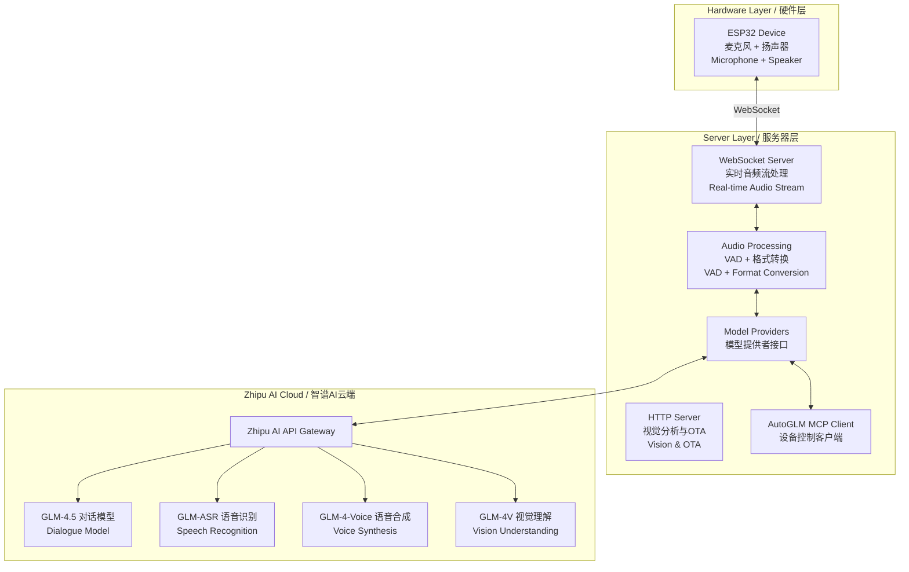
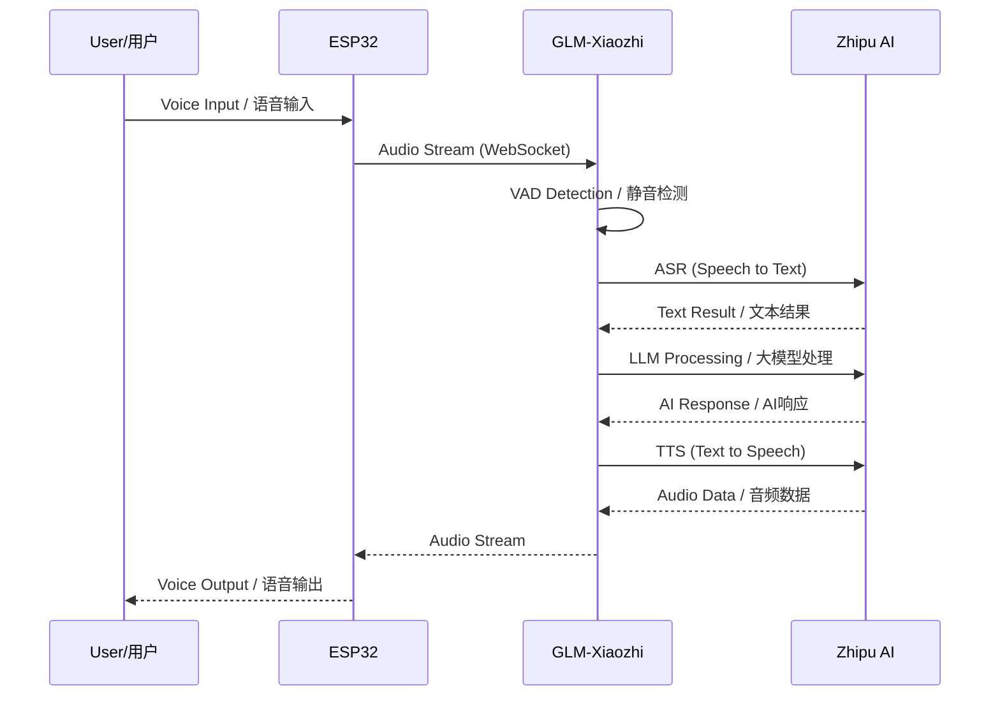
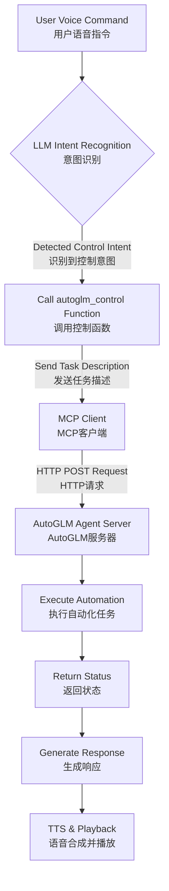

# GLM-Xiaozhi 小智AI语音助手 - 智谱AI集成版

<div align="center">


[](https://opensource.org/licenses/MIT)
[](https://www.python.org/)
[](https://open.bigmodel.cn/)
[](https://github.com/YOUR_USERNAME/xiaozhi-esp32-server-glm)

> 🎙️ **Open-source intelligent voice assistant powered by ESP32 hardware and Zhipu AI models**
> 
> 基于ESP32硬件与智谱AI大模型的开源智能语音助手
> 
> Original project by [@78](https://github.com/78) | 原项目来自虾哥的开源贡献

</div>

---

## 📌 Table of Contents / 目录

- [Project Overview / 项目概述](#project-overview--项目概述)
- [System Architecture / 系统架构](#system-architecture--系统架构)
- [Core Features / 核心特性](#core-features--核心特性)
- [Quick Start / 快速开始](#quick-start--快速开始)
- [Model Selection Guide / 模型选择指南](#model-selection-guide--模型选择指南)
- [Performance Benchmarks / 性能测试](#performance-benchmarks--性能测试)
- [AutoGLM Integration / AutoGLM集成](#autoglm-integration--autoglm集成)
- [Configuration / 配置](#configuration--配置)
- [Troubleshooting / 故障排除](#troubleshooting--故障排除)
- [Contributing / 贡献](#contributing--贡献)

---

## Project Overview / 项目概述

**GLM-Xiaozhi** is a comprehensive transformation of the [Xiaozhi AI Voice Assistant](https://github.com/78/xiaozhi-esp32) server backend, implementing seamless integration with Zhipu AI's full model suite. This project provides a complete private deployment solution that eliminates dependency on official servers while delivering enhanced conversational, voice, and visual capabilities.

本项目是对[小智AI语音助手](https://github.com/78/xiaozhi-esp32)服务器端的全面改造，实现与智谱AI全系列模型的无缝对接，提供完全私有化的部署方案。

### 🌟 Key Highlights / 核心亮点

- **🔒 Complete Privatization / 完全私有化**: Deploy all services on your own server for maximum data privacy
- **🤖 Zhipu AI Full Stack / 智谱AI全家桶**: Integrated support for GLM-4.5 series, voice models, and vision capabilities
- **🎯 AutoGLM Control / 智能控制**: Device automation through MCP protocol integration
- **📦 Modular Architecture / 模块化架构**: Easy-to-extend Provider pattern design
- **🚀 Lightweight Deployment / 轻量化部署**: Direct source code deployment without Docker dependencies

---

## System Architecture / 系统架构

### Overall Architecture Diagram / 整体架构图



### Workflow Sequence / 工作流程



---

## Core Features / 核心特性

### 🎤 Voice Interaction / 语音交互
- **ASR (Speech Recognition / 语音识别)**: GLM-ASR, FunASR, SherpaASR
- **TTS (Text to Speech / 语音合成)**: CogTTS, GLM-4-Voice, EdgeTTS
- **VAD (Voice Activity Detection / 静音检测)**: Real-time speech boundary detection

### 🧠 AI Models / AI模型
- **Language Models / 语言模型**: GLM-4.5 series (Flash, Air, Plus, X)
- **Vision Models / 视觉模型**: GLM-4V-Flash, GLM-4.5V
- **Multi-modal Support / 多模态支持**: Image understanding and analysis

### 🔧 System Features / 系统功能
- **AutoGLM Integration / AutoGLM集成**: Device control via MCP protocol
- **Memory System / 记忆系统**: Short-term conversation memory
- **Music Playback / 音乐播放**: Local and online music support
- **OTA Updates / OTA更新**: Web-based configuration interface

---

## Quick Start / 快速开始

### Prerequisites / 环境要求

**Hardware Requirements / 硬件要求:**
- Minimum / 最低配置: 2 cores, 4GB RAM (API-only mode)
- Recommended / 推荐配置: 4 cores, 8GB RAM (with local models)
- Storage / 存储空间: 10GB+ available space

**Software Requirements / 软件要求:**
- OS / 操作系统: Linux (Ubuntu 20.04+, CentOS 7+, Alibaba Cloud Linux)
- Python: 3.8+
- Network / 网络: Public IP with open ports (8000, 8003)

### Installation Steps / 安装步骤

#### 1. Obtain Zhipu AI API Key / 获取智谱AI API密钥

Visit [Zhipu AI Platform](https://open.bigmodel.cn) to register and create your API key.

访问[智谱开放平台](https://open.bigmodel.cn)注册并创建API密钥。

#### 2. Clone Repository / 克隆项目

```bash
# Clone the repository / 克隆仓库
git clone https://github.com/YOUR_USERNAME/GLM-Xiaozhi.git
cd GLM-Xiaozhi

# Add upstream repository / 添加上游仓库
git remote add upstream https://github.com/78/xiaozhi-esp32-server.git
```

#### 3. Setup Python Environment / 设置Python环境

```bash
# Create virtual environment / 创建虚拟环境
python3 -m venv venv
source venv/bin/activate

# Install dependencies / 安装依赖
pip install -r requirements.txt
```

#### 4. Configure API Keys / 配置API密钥

Create a secure configuration override:

```bash
# Create data directory / 创建数据目录
mkdir data

# Create override config / 创建覆盖配置
touch data/.config.yaml
```

Edit `data/.config.yaml`:

```yaml
# Zhipu AI Configuration / 智谱AI配置
LLM:
  GLM-45:
    api_key: "your-zhipu-api-key-here"
    temperature: 0.7  # Optional / 可选
    max_tokens: 2048  # Optional / 可选
  
  ChatGLMLLM:
    api_key: "your-zhipu-api-key-here"

VLLM:
  ChatGLMVLLM:
    api_key: "your-zhipu-api-key-here"

ASR:
  GLMASR:
    api_key: "your-zhipu-api-key-here"

TTS:
  CogTTS:
    api_key: "your-zhipu-api-key-here"

# AutoGLM Configuration (Optional)
autoglm:
  api_key: "your-autoglm-token"
  base_url: "http://your-autoglm-server:port"
```

#### 5. Start the Server / 启动服务器

```bash
# Direct run / 直接运行
python app.py

# Background run / 后台运行
nohup python app.py > xiaozhi.log 2>&1 &

# Using systemd (Recommended / 推荐)
sudo systemctl start glm-xiaozhi
sudo systemctl enable glm-xiaozhi  # Auto-start on boot / 开机自启
```

### Service Endpoints / 服务端点

After successful startup, the following endpoints will be available:

| Endpoint / 端点 | URL | Description / 描述 |
|----------------|-----|-------------------|
| WebSocket | `ws://YOUR_IP:8000/xiaozhi/v1/` | Real-time audio streaming / 实时音频流 |
| Vision API | `http://YOUR_IP:8003/mcp/vision/explain` | Image analysis / 图像分析 |
| OTA Config | `http://YOUR_IP:8003/xiaozhi/ota/` | Web configuration / 网页配置 |
| Test Tool | `http://YOUR_IP:8003/xiaozhi/ota/` | Service testing / 服务测试 |

---

## Model Selection Guide / 模型选择指南

Choose the optimal model configuration based on your requirements:

### Language Models (LLM) / 语言模型

| Model / 模型 | Speed / 速度 | Intelligence / 智能 | Cost / 成本 | Use Case / 使用场景 |
|-------------|-------------|-------------------|------------|-------------------|
| **glm-4-flash** | ⚡⚡⚡⚡⚡ | ⭐⭐⭐ | 💰 | Quick responses, daily Q&A / 快速响应，日常问答 |
| **glm-4.5-flash** | ⚡⚡⚡⚡⚡ | ⭐⭐⭐ | 💰 | Fast interactions / 快速交互 |
| **glm-4.5-air** | ⚡⚡⚡⚡ | ⭐⭐⭐⭐ | 💰💰 | **Balanced choice** / **平衡之选** |
| **glm-4.5-airx** | ⚡⚡⚡⚡ | ⭐⭐⭐⭐⭐ | 💰💰 | Complex tasks / 复杂任务 |
| **glm-4-plus** | ⚡⚡⚡ | ⭐⭐⭐⭐⭐ | 💰💰💰 | Professional analysis / 专业分析 |
| **glm-4.5-x** | ⚡⚡ | ⭐⭐⭐⭐⭐ | 💰💰💰💰 | Maximum capability / 最强能力 |

### Vision Models (VLLM) / 视觉模型

| Model / 模型 | Response Time / 响应时间 | Capability / 能力 | Recommended / 推荐度 |
|-------------|------------------------|------------------|-------------------|
| **glm-4v-flash** | 3.2s | Basic vision / 基础视觉 | ★★★★★ |
| **glm-4.1v-thinking-flash** | 6.8s | Reasoning / 推理分析 | ★★★★☆ |
| **glm-4.5v** | 6.9s | Advanced / 高级分析 | ★★★★☆ |

### Audio Models / 音频模型

| Type / 类型 | Model / 模型 | Cost / 成本 | Quality / 质量 | Privacy / 隐私 |
|------------|-------------|------------|---------------|---------------|
| **ASR** | GLMASR (API) | Pay-per-use / 按量付费 | ★★★★★ | Cloud / 云端 |
| **ASR** | FunASR (Local) | Free / 免费 | ★★★★☆ | Local / 本地 |
| **TTS** | CogTTS | Pay-per-use / 按量付费 | ★★★★★ | Cloud / 云端 |
| **TTS** | EdgeTTS | Free / 免费 | ★★★☆☆ | Microsoft / 微软 |

---

## Performance Benchmarks / 性能测试

All tests conducted on 4-core 8GB cloud server / 所有测试在4核8GB云服务器上进行

### LLM Performance / 语言模型性能

Test query / 测试语句: "你好，请介绍一下你自己"

| Model / 模型 | Total Time / 总耗时 | First Token / 首Token | Success Rate / 成功率 |
|-------------|-------------------|---------------------|---------------------|
| **GLM-45-AirX** | 1.682s | 1.297s | 100% (3/3) |
| **GLM-45-Air** | 1.856s | 1.394s | 100% (3/3) |
| **ChatGLMLLM** | 2.035s | 0.739s | 100% (3/3) |
| **GLM-4-Plus** | 2.134s | 0.585s | 100% (3/3) |

### Vision Model Performance / 视觉模型性能

| Model / 模型 | Response Time / 响应时间 | Stability / 稳定性 |
|-------------|------------------------|-------------------|
| **ChatGLMVLLM** | 3.221s | 0.483 |
| **GLM-41V-Thinking** | 6.820s | 0.523 |
| **GLM-45V** | 6.923s | 0.343 |

### ASR Performance / 语音识别性能

| Model / 模型 | Average Time / 平均耗时 | Type / 类型 |
|-------------|----------------------|------------|
| **SherpaASR** | 2.867s | Local / 本地 |
| **FunASR** | 3.058s | Local / 本地 |
| **GLMASR** | 4.374s | API / 云端 |

---

## AutoGLM Integration / AutoGLM集成

### Overview / 概述

AutoGLM transforms Xiaozhi from a simple voice assistant into an intelligent agent capable of controlling your devices through natural language commands.

AutoGLM将小智从简单的语音助手升级为能够通过自然语言控制设备的智能代理。

### How It Works / 工作原理



### Example Commands / 示例命令

- "打开网易云音乐" / "Open NetEase Music"
- "帮我打开微信并发送消息" / "Open WeChat and send a message"
- "查看今天的日程安排" / "Check today's schedule"
- "设置明天早上8点的闹钟" / "Set an alarm for 8 AM tomorrow"

### Configuration / 配置

The core control logic is implemented in `plugins_func/functions/autoglm_control.py`:

```python
@register_function
async def autoglm_control(task_description: str, action: str = "start_task"):
    """
    Control devices through AutoGLM
    通过AutoGLM控制设备
    """
    # Implementation details...
```

---

## Configuration / 配置

### ESP32 Device Configuration / ESP32设备配置

#### Method 1: OTA Web Configuration / 方法1：OTA网页配置

1. Access / 访问: `http://YOUR_IP:8003/xiaozhi/ota/`
2. Enter WebSocket address / 输入WebSocket地址
3. Save configuration / 保存配置

#### Method 2: ESP-IDF Configuration / 方法2：ESP-IDF配置

```bash
# Configure via menuconfig / 通过menuconfig配置
idf.py menuconfig

# Build and flash / 编译并烧录
idf.py build
idf.py flash

# Monitor output / 监控输出
idf.py monitor
```

### Server Configuration / 服务器配置

Main configuration file structure / 主配置文件结构:

```yaml
# config.yaml
selected_module:
  llm_module_name: "ChatGLMLLM"  # LLM provider
  asr_module_name: "GLMASR"      # ASR provider
  tts_module_name: "CogTTS"      # TTS provider
  vllm_module_name: "ChatGLMVLLM" # Vision provider

# Model-specific configurations
LLM:
  ChatGLMLLM:
    model_name: "glm-4-flash"
    api_key: ""  # Set in data/.config.yaml
    temperature: 0.7
    max_tokens: 2048

# System settings
GENERAL:
  vad_threshold: 0.5
  audio_format: "pcm"
  sample_rate: 16000
```

---

## Troubleshooting / 故障排除

### Common Issues / 常见问题

#### 1. WebSocket Connection Failed / WebSocket连接失败

**Symptoms / 症状:**
- ESP32 cannot connect to server / ESP32无法连接到服务器
- Connection timeout errors / 连接超时错误

**Solutions / 解决方案:**
```bash
# Check firewall settings / 检查防火墙设置
sudo firewall-cmd --add-port=8000/tcp --permanent
sudo firewall-cmd --add-port=8003/tcp --permanent
sudo firewall-cmd --reload

# Verify server is running / 验证服务器运行状态
netstat -antp | grep python
```

#### 2. GLM-4-Voice Issues / GLM-4-Voice问题

**Known Issue / 已知问题:**
- API may return errors in certain conditions
- API在特定条件下可能返回错误

**Temporary Solution / 临时方案:**
- Use CogTTS as primary TTS provider
- 使用CogTTS作为主要TTS提供者

#### 3. High Latency / 高延迟

**Optimization Steps / 优化步骤:**
1. Switch to faster models (Flash series) / 切换到更快的模型（Flash系列）
2. Enable local ASR if possible / 如可能启用本地ASR
3. Check network connectivity / 检查网络连接
4. Monitor server resources / 监控服务器资源

### Logging and Debugging / 日志和调试

```bash
# View real-time logs / 查看实时日志
tail -f xiaozhi.log

# Check error logs / 检查错误日志
grep ERROR xiaozhi.log

# Monitor system resources / 监控系统资源
htop

# Check Python processes / 检查Python进程
ps aux | grep python
```

---

## Advanced Features / 高级功能

### Custom Personas / 自定义角色

The project includes "小平老师" (Teacher Xiaoping), an AI assistant persona specialized in:
- Technical explanations / 技术讲解
- Programming guidance / 编程指导
- Project consulting / 项目咨询

Configure custom personas in `config.yaml`:

```yaml
prompt:
  system_prompt: |
    你是小平老师，一位精通智谱AI全栈技术的专家...
    You are Teacher Xiaoping, an expert in Zhipu AI technologies...
```

### Music Control / 音乐控制

- **Local Music / 本地音乐**: Place `.mp3` files in the `music` folder
- **Online Music / 在线音乐**: Control music apps via AutoGLM
- **Voice Commands / 语音命令**: "播放音乐" / "Play music"

### Memory System / 记忆系统

- **Short-term Memory / 短期记忆**: Current conversation context
- **Long-term Memory / 长期记忆** (Planned): User preferences and habits

---

## Development / 开发

### Provider Architecture / Provider架构

The system uses a modular Provider pattern for easy extension:

```python
# Example: Custom LLM Provider
class CustomLLMProvider(BaseLLMProvider):
    async def response(self, prompt: str):
        # Implementation
        pass
    
    async def response_with_functions(self, prompt: str, functions: list):
        # Implementation with function calling
        pass
```

### Adding New Models / 添加新模型

1. Create provider class in appropriate directory / 在相应目录创建Provider类
2. Implement required interfaces / 实现必要接口
3. Register in configuration / 在配置中注册
4. Update selected modules / 更新选择的模块

---

## API Pricing Reference / API价格参考

| Service / 服务 | Model / 模型 | Pricing / 价格 |
|---------------|-------------|---------------|
| **LLM** | GLM-4-Flash | ¥0.0001/1K tokens |
| **LLM** | GLM-4.5-Air | ¥0.001/1K tokens |
| **LLM** | GLM-4-Plus | ¥0.05/1K tokens |
| **ASR** | GLM-ASR | ¥0.06/minute |
| **TTS** | CogTTS | ¥80/1M tokens |
| **Vision** | GLM-4V-Flash | ¥0.002/1K tokens |

---

## Contributing / 贡献

We welcome contributions! Please:

1. Fork the repository / Fork仓库
2. Create a feature branch / 创建特性分支
3. Commit your changes / 提交更改
4. Push to the branch / 推送到分支
5. Create a Pull Request / 创建Pull Request

### Development Guidelines / 开发指南

- Follow PEP 8 style guide / 遵循PEP 8风格指南
- Add tests for new features / 为新功能添加测试
- Update documentation / 更新文档
- Maintain backward compatibility / 保持向后兼容

---

## License / 开源协议

This project is based on the original project's open-source license. We thank [@78](https://github.com/78) for the original contribution.

本项目基于原项目的开源协议，感谢虾哥的开源贡献。

---

## Acknowledgments / 致谢

- **[@78 (虾哥)](https://github.com/78)** - Original Xiaozhi AI Voice Assistant creator / 小智AI语音助手原作者
- **[Zhipu AI / 智谱AI](https://www.zhipuai.cn/)** - Powerful AI model support / 强大的AI模型支持
- **All contributors and users / 所有贡献者和使用者**

---

## Resources / 相关资源

- [Original Project / 原项目](https://github.com/78/xiaozhi-esp32)
- [Server Repository / 服务器端](https://github.com/78/xiaozhi-esp32-server)
- [Zhipu AI Documentation / 智谱AI文档](https://open.bigmodel.cn/dev/api)
- [ESP32 Documentation / ESP32文档](https://docs.espressif.com/projects/esp-idf/zh_CN/latest/esp32/)
- [Hardware Tutorial / 硬件制作教程](https://github.com/78/xiaozhi-esp32)

---

## Contact & Support / 联系与支持

- **Issues**: Please submit issues on [GitHub Issues](https://github.com/YOUR_USERNAME/GLM-Xiaozhi/issues)
- **Discussions**: Join our community discussions
- **Email**: your-email@example.com

---

<div align="center">

**⚠️ Note / 注意**

This project is for learning and research purposes only.

本项目仅供学习和研究使用。

---

Made with ❤️ by the Xiaozhi Community

</div>
