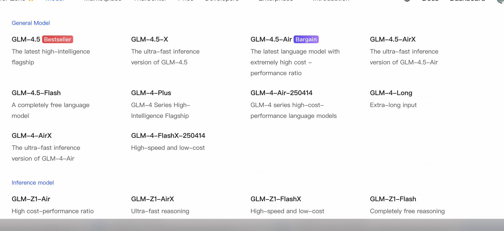
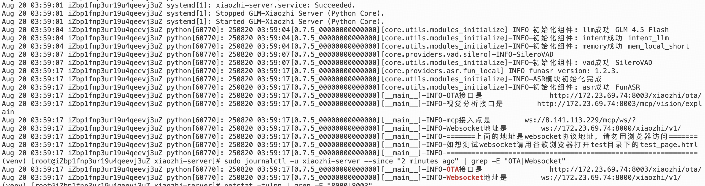
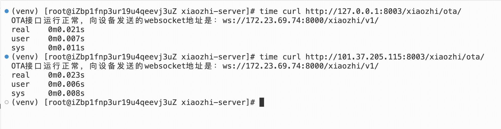
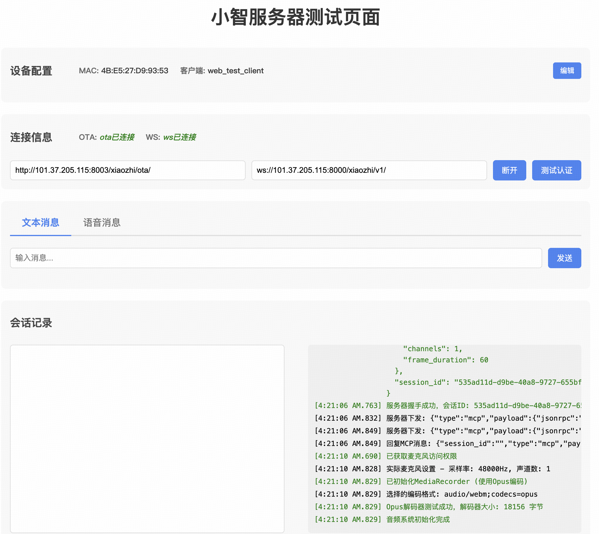
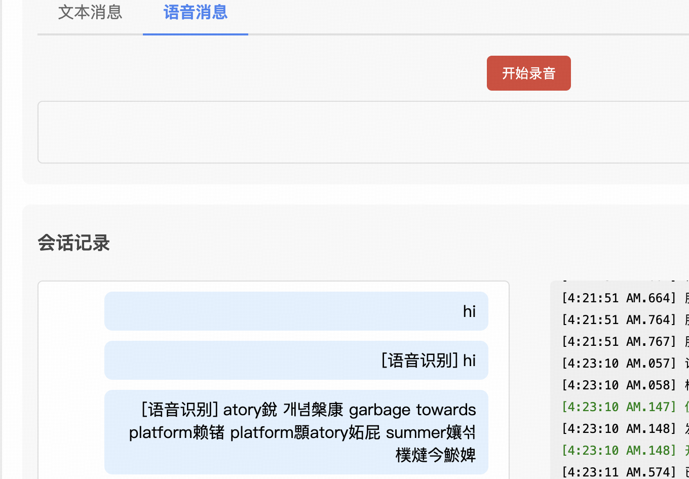

# GLM-Xiaozhi Server (小智语音助手服务器端 - 智谱BigModel后端集成版)

🙏 Credit to 虾哥for the original xiaozhi-esp32 open source project

- 基于虾哥开源的[xiaozhi-esp32](https://github.com/78/xiaozhi-esp32)项目，仅替换后端AI服务为智谱BigModel
- 基于 [xiaozhi-esp32-server](https://github.com/xinnan-tech/xiaozhi-esp32-server) 的精简和修改版。

我们移除了原有的 Java 后端和 Web 管理前端，专注于提供一个轻量级、易于部署的 Python 核心引擎，与智谱大模型集成，为 [xiaozhi-esp32 硬件](https://github.com/78/xiaozhi-esp32) 提供独立的后端支持。

## 特性
*   **轻量化部署：** 仅保留 Python 核心引擎。
*   **独立运行：** 完全依赖本地配置文件 (`config.yaml`)，不依赖外部管理平台。
*   **Zhipu BigModel集成：** 原生支持接入智谱AI大模型。

Websocket: ws://101.37.205.115:8000/xiaozhi/v1/
OTA: http://101.37.205.115:8003/xiaozhi/ota/

